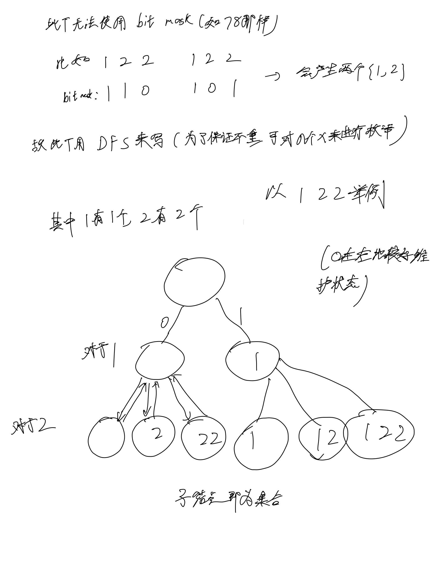

# [90. 子集 II](https://leetcode.cn/problems/subsets-ii/description/)

## 思考



## 代码

### C++

```c++
class Solution {
public:
    vector<vector<int>> res;
    vector<int> path;

    void dfs(vector<int>& nums, int n, int u) {
        if (u == n) {
            res.emplace_back(path);
            return;
        }

        int k = u;
        while (k < n && nums[k] == nums[u]) k ++;

        int cnt = k - u;
        for (int i = 0; i <= cnt; i ++) {
            dfs(nums, n, k);
            path.emplace_back(nums[u]);
        }

        for (int i = 0; i <= cnt; i ++) {
            path.pop_back();
        }
    }

    vector<vector<int>> subsetsWithDup(vector<int>& nums) {
        sort(nums.begin(), nums.end());
        int n = nums.size();
        dfs(nums, n, 0);

        return res;
    }
};
```

### C

```c

```
