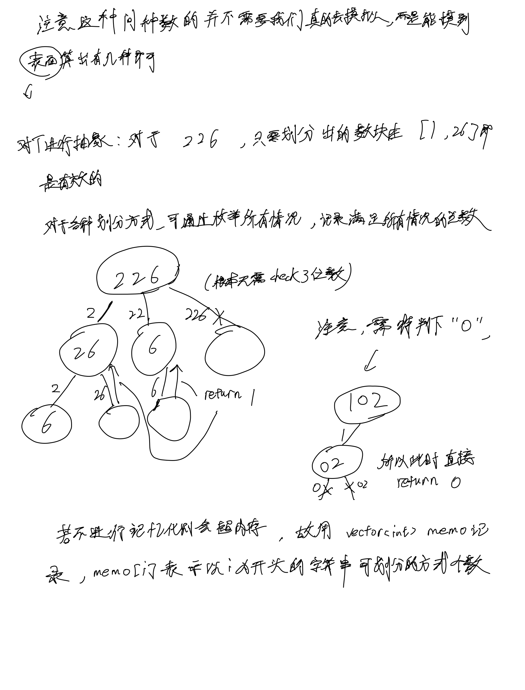
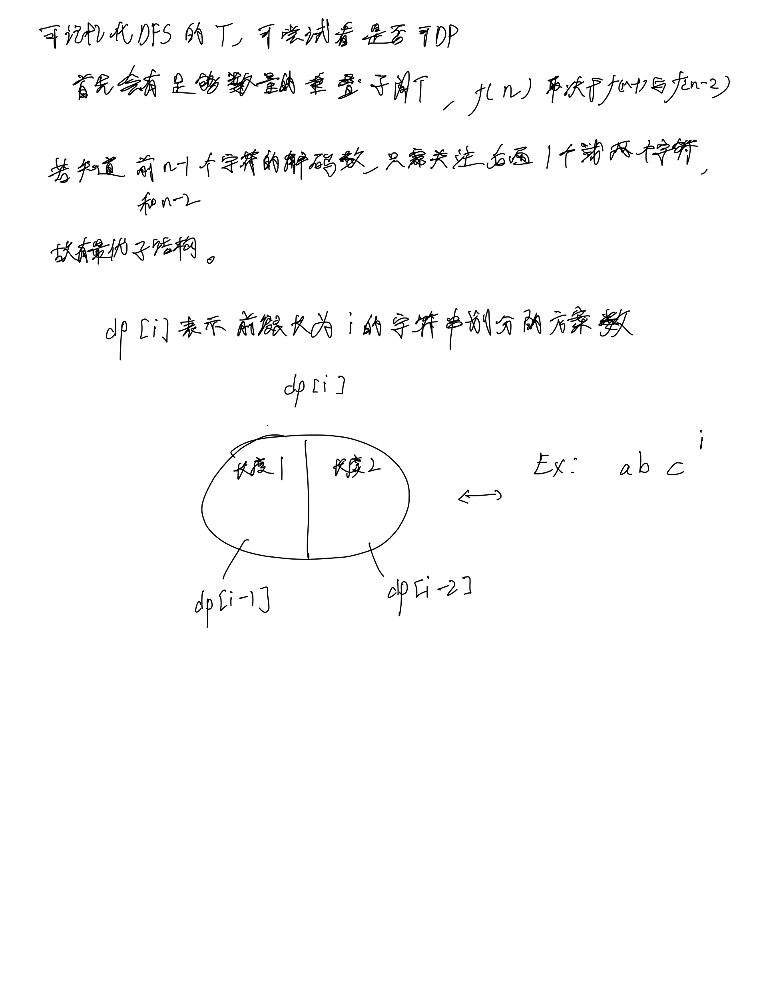

# [91. 解码方法](https://leetcode.cn/problems/decode-ways/)

## 思考




## 代码

### 记忆化搜索

#### C++

```c++
class Solution {
public:
    int dfs(string s, int u, vector<int>& memo) {
        if (u == s.size()) {
            return 1;
        }
        if (s[u] == '0') {
            return 0;
        }
        if (memo[u] != -1) {
            return memo[u];
        }

        int cnt = 0;
        cnt += dfs(s, u + 1, memo);

        if (u + 1 < s.size()) {
            string t = s.substr(u, 2);
            if (t <= "26" && t >= "1") {
                cnt += dfs(s, u + 2, memo);
            }
        }

        return memo[u] = cnt;
    }

    int numDecodings(string s) {
        vector<int> memo(s.size(), -1);
        int res = dfs(s, 0, memo);

        return res;
    }
};
```

#### C

```c
int dfs(char* s, int u, int memo[]) {
    int n = strlen(s);
    if (u == n) {
        return 1;
    }
    if (s[u] == '0') {
        return 0;
    }

    if (memo[u] != -1) {
        return memo[u];
    }

    int cnt = 0;
    cnt += dfs(s, u + 1, memo);

    if (u + 1 < n) {
        char t[3];
        strncpy(t, s + u, 2);
        t[2] = '\0';
        int val = atoi(t);
        if (val <= 26 && val >= 1) {
            cnt += dfs(s, u + 2, memo);
        }
    }

    return memo[u] = cnt;
}

int numDecodings(char* s) {
    int memo[110];
    memset(memo, -1, sizeof memo);
    int res = dfs(s, 0, memo);

    return res;
}
```

### DP

#### C++

```c++
class Solution {
public:
    int numDecodings(string s) {
        int n = s.size();
        vector<int> dp(n + 1, 0);

        dp[0] = 1;
        if (s[0] != '0') {
            dp[1] = 1;
        }

        for (int i = 2; i <= n; i ++) {
            if (s[i - 1] != '0') {
                dp[i] += dp[i - 1];
            }

            string t = s.substr(i - 2, 2);
            if (t >= "1" && t <= "26") {
                dp[i] += dp[i - 2];
            }
        }

        return dp[n];
    }
};
```

#### C

```c
int numDecodings(char* s) {
    int n = strlen(s);
    int dp[110];
    memset(dp, 0, sizeof dp);

    dp[0] = 1;
    if (s[0] != '0') {
        dp[1] = 1;
    }

    for (int i = 2; i <= n; i ++) {
        if (s[i - 1] != '0') {
            dp[i] += dp[i - 1];
        }

        int t = (s[i - 2] - '0') * 10 + s[i - 1] - '0';
        if (t >= 10 && t <= 26) {
            dp[i] += dp[i - 2];
        }
    }

    return dp[n];
}
```
