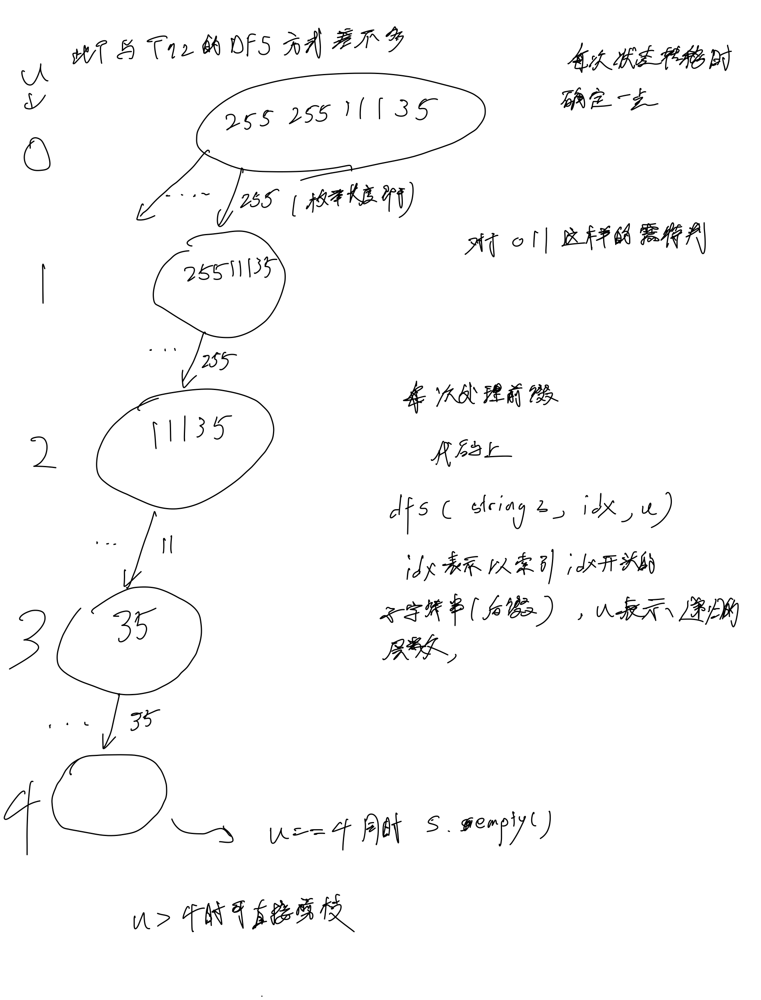
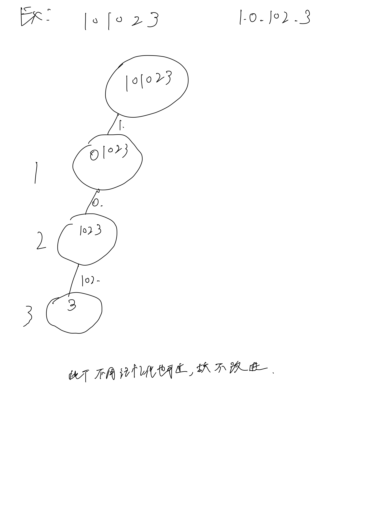

# [93. 复原 IP 地址](93. 复原 IP 地址)

## 思考




## 代码

### 普通DFS

#### C++

```c++
class Solution {
public:
    vector<string> res;
    string path;

    void dfs(const string &s, int idx, int u) {
        if (idx == s.size() && u == 4) {
            res.emplace_back(path.substr(0, path.size() - 1));
        }
        if (u > 4) {
            return;
        }

        for (int i = 1; i <= 3; i ++) {
            if (idx + i > s.size()) break;

            string t = s.substr(idx, i);
            if (i >= 2 && t[0] == '0') break;
            int val = stoi(t);
            if (val >= 0 && val <= 255) {
                path += t + ".";
                // DEBUG:
                // cout << "idx: " << idx << " u:" << u << " i:" << i << endl;
                // cout << path << endl;
                dfs(s, idx + i, u + 1);
                for (int j = 0; j < i + 1; j ++) {
                    path.pop_back();
                }
            }
        }
    }

    vector<string> restoreIpAddresses(string s) {
        dfs(s, 0, 0);

        return res;
    }
};
```

#### C

```c
/**
 * Note: The returned array must be malloced, assume caller calls free().
 */

char** res;
int res_sz;
char path[40];

void dfs(char* s, int n, int idx, int u) {
    if (idx == n && u == 4) {
        char t[40];
        strncpy(t, path, strlen(path));
        t[strlen(path) - 1] = '\0';
        res[res_sz] = (char*)malloc(strlen(path) + 1);
        strcpy(res[res_sz], t);
        res_sz ++;
        return;
    }

    if (u > 4) {
        return;
    }

    for (int i = 1; i <= 3; i ++) {
        if (idx + i > n) break;

        char t[4];
        strncpy(t, s + idx, i);
        t[i] = '\0';
        if (i >= 2 && t[0] == '0') break;

        int val = atoi(t);
        if (val >= 0 && val <= 255) {
            strcat(path, t);
            strcat(path, ".");
            dfs(s, n, idx + i, u + 1);
            path[strlen(path) - i - 1] = '\0'; // -1 mean '.'
        }
    }
}

char** restoreIpAddresses(char* s, int* returnSize) {
    *returnSize = 0; // init(if res is  NULL, return 0)
    int n = strlen(s);
    res = (char **)malloc(sizeof(char *) * n * n);
    res_sz = 0;
    memset(path, 0, sizeof(path));

    dfs(s, n, 0, 0);
    *returnSize = res_sz;

    return res;
}
```
