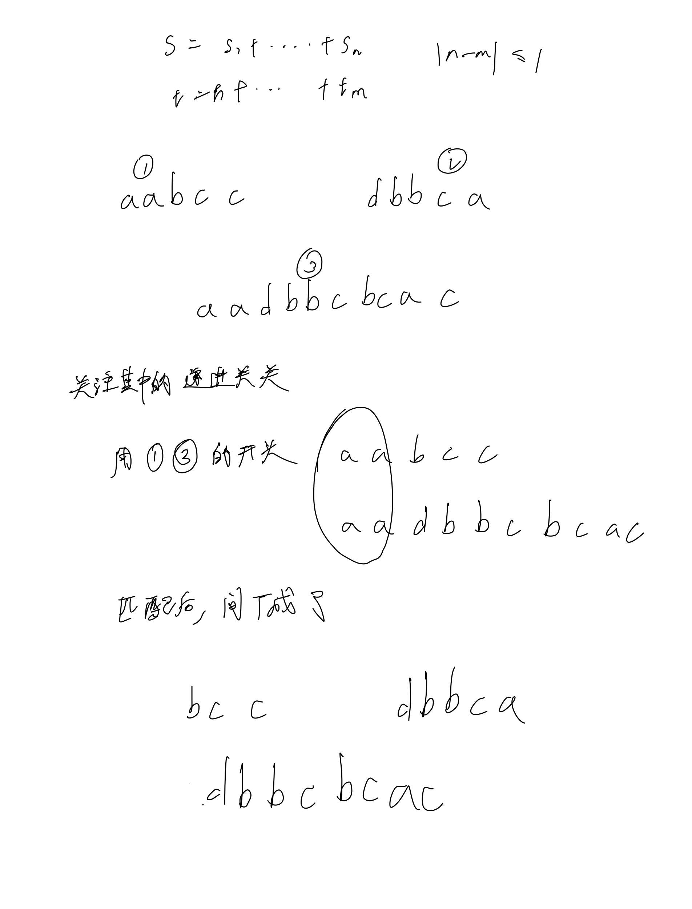
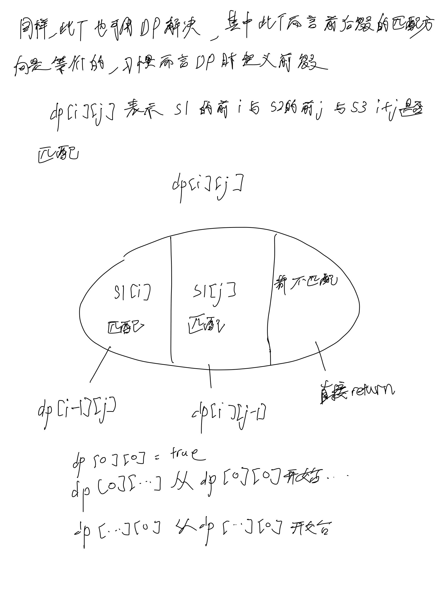

# [97. 交错字符串](https://leetcode.cn/problems/interleaving-string/)

## 思考





## 代码

### DFS+记忆化

#### Cpp

```c++
class Solution {
public:
    vector<vector<int>> memo;
    bool dfs(string& s1, string& s2, string& s3, int i, int j) {
        if (memo[i][j] != -1) {
            return memo[i][j];
        }
        if (i == s1.size() && j == s2.size()) {
            memo[i][j] = 1;
            return true;
        }

        bool res = false;
        if (i < s1.size() && s1[i] == s3[i + j]) {
            res |= dfs(s1, s2, s3, i + 1, j);
        }
        if (res == true) {
            memo[i][j] = true;
            return true;
        }

        if (j < s2.size() && s2[j] == s3[i + j]) {
            res |= dfs(s1, s2, s3, i, j + 1);
        }

        memo[i][j] = res;
        return res;
    }
    
    bool isInterleave(string s1, string s2, string s3) {
        if (s1.size() + s2.size() != s3.size()) {
            return false;
        }
        memo = vector<vector<int>>(s1.size() + 10, vector<int>(s2.size() + 10, -1));

        return dfs(s1, s2, s3, 0, 0);
    }
};```

#### C

```c
int memo[110][110];

bool dfs(char* s1, char* s2, char* s3, int i, int j) {
        if (memo[i][j] != -1) {
            return memo[i][j];
        }
        int n = strlen(s1), m = strlen(s2);
        if (i == n && j == m) {
            memo[i][j] = 1;
            return true;
        }

        bool res = false;
        if (i < n && s1[i] == s3[i + j]) {
            res |= dfs(s1, s2, s3, i + 1, j);
        }
        if (res == true) {
            memo[i][j] = true;
            return true;
        }

        if (j < m && s2[j] == s3[i + j]) {
            res |= dfs(s1, s2, s3, i, j + 1);
        }

        memo[i][j] = res;
        return res;
}

bool isInterleave(char* s1, char* s2, char* s3) {
    if (strlen(s1) + strlen(s2) != strlen(s3)) {
        return false;
    }
    memset(memo, -1, sizeof memo);
    return dfs(s1, s2, s3, 0, 0);
}
```

### DP

#### Cpp

```c++
class Solution {
public:
    bool isInterleave(string s1, string s2, string s3) {
        int n = s1.size(), m = s2.size();
        if (n + m != s3.size()) {
            return false;
        }

        vector<vector<bool>> dp(n + 1, vector<bool>(m + 1, false));
        s1 = ' ' + s1;
        s2 = ' ' + s2;
        s3 = ' ' + s3;

        dp[0][0] = true;
        for (int i = 1; i <= n; i ++) {
            if (s1[i] == s3[i]) {
                dp[i][0] = dp[i - 1][0];
            }
        }
        for (int i = 1; i <= m; i ++) {
            if (s2[i] == s3[i]) {
                dp[0][i] = dp[0][i - 1];
            }
        }

        for (int i = 1; i <= n; i ++) {
            for (int j = 1; j <= m; j ++) {
                if (s1[i] == s3[i + j]) {
                    dp[i][j] = dp[i - 1][j];
                }
                if (s2[j] == s3[i + j]) {
                    dp[i][j] = dp[i][j] || dp[i][j - 1];
                }
            }
        }
        
        return dp[n][m];
    }
};
```

#### C

这里需要注意下, 这里不方便让字符串前面添加空格来让坐标向后移, 所以迭代的时候注意字符串的下标即可

```c
bool isInterleave(char* s1, char* s2, char* s3) {
        int n = strlen(s1), m = strlen(s2);
        if (n + m != strlen(s3)) {
            return false;
        }

        bool dp[110][110];
        memset(dp, 0, sizeof dp);

        dp[0][0] = true;
        for (int i = 1; i <= n; i ++) {
            if (s1[i - 1] == s3[i - 1]) {
                dp[i][0] = dp[i - 1][0];
            }
        }
        for (int i = 1; i <= m; i ++) {
            if (s2[i - 1] == s3[i - 1]) {
                dp[0][i] = dp[0][i - 1];
            }
        }

        for (int i = 1; i <= n; i ++) {
            for (int j = 1; j <= m; j ++) {
                if (s1[i - 1] == s3[i + j - 1]) {
                    dp[i][j] = dp[i - 1][j];
                }
                if (s2[j - 1] == s3[i + j - 1]) {
                    dp[i][j] = dp[i][j] || dp[i][j - 1];
                }
            }
        }
        
        return dp[n][m];
}
```
```
```
