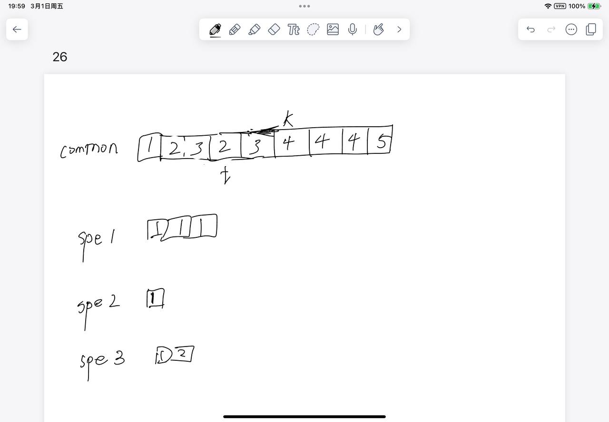

# [26. 删除有序数组中的重复项](https://leetcode.cn/problems/remove-duplicates-from-sorted-array/description/)

## 思考

- c++ unique的实现
- 两个指针, 一个指针指向前面不重的子数组的后一位, 一个指针用来找到每次遍历的第一个与前一个不同的数
- 一些情况
    - 

## 代码

```c++
class Solution {
public:
    int removeDuplicates(vector<int>& nums) {
        if (nums.size() == 1) return 1;
        int tail = 1, k = 1;
        while (k < nums.size()) {
            if (nums[k - 1] != nums[k]) {
                nums[tail ++] = nums[k];
            }
            k ++;
        }
        return tail;
    }
};
```
