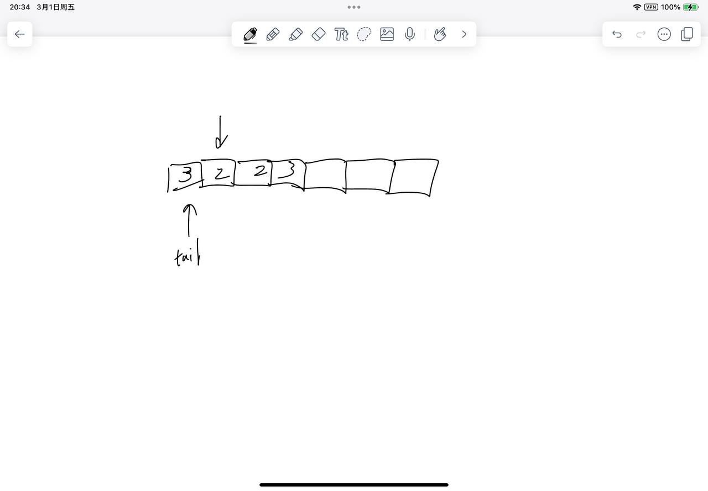

# [27. 移除元素](https://leetcode.cn/problems/remove-element/)

## 思考

- 和26差不多的思路
- 两个指针, 一个tail来填, 一个来找不等于val的值就填到tail的位置, 需要考虑的特殊情况比26少
- 

## 代码

```c++
class Solution {
public:
    int removeElement(vector<int>& nums, int val) {
        int tail = 0, k = 0;
        while (k < nums.size()) {
            if (nums[k] != val) {
                nums[tail ++] = nums[k]; 
            }
            k ++;
        }
        return tail;
    }
};
```
