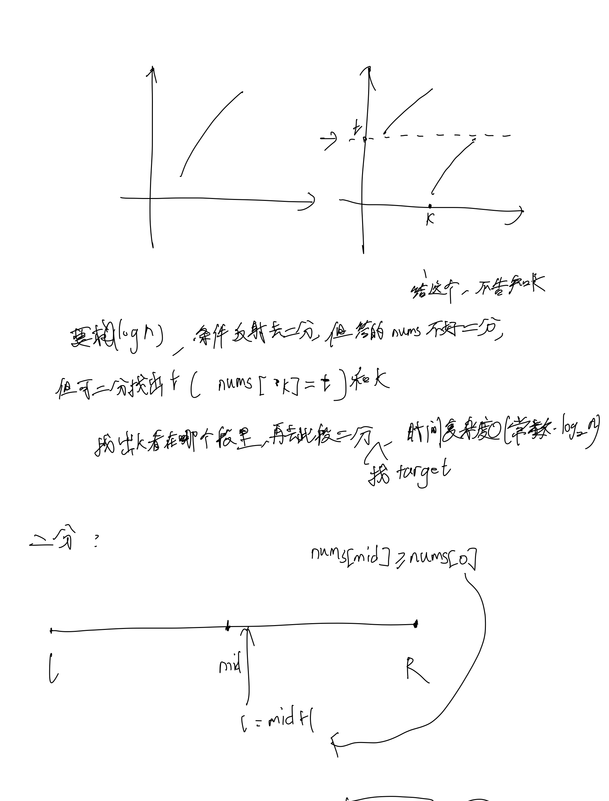
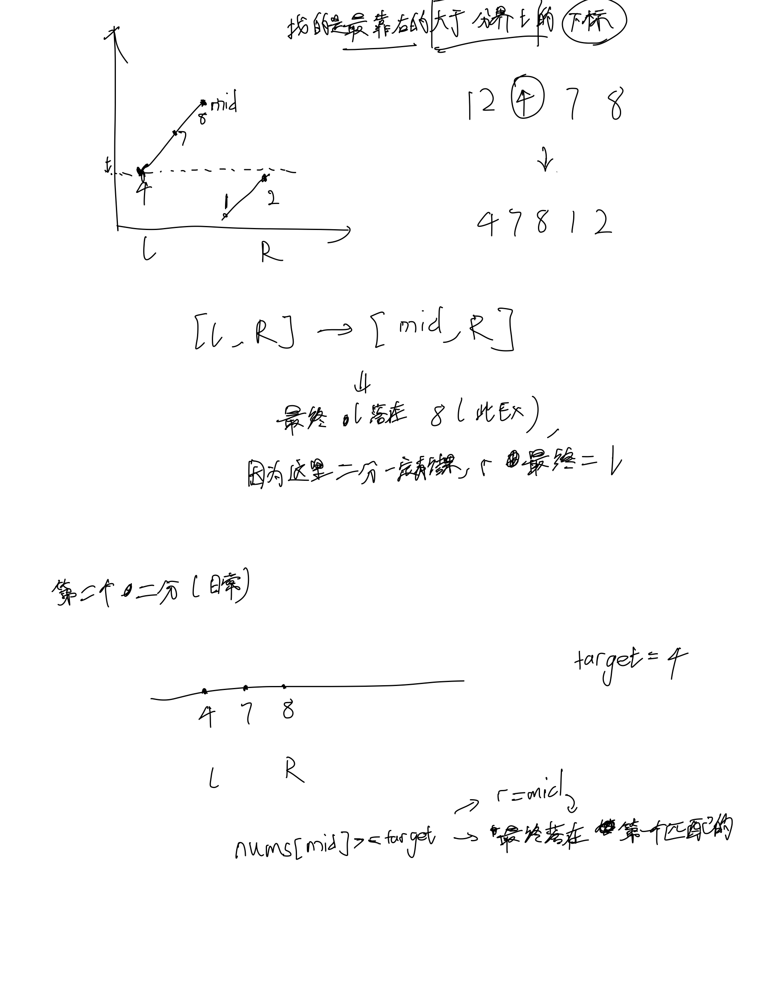

# [33. 搜索旋转排序数组](https://leetcode.cn/problems/search-in-rotated-sorted-array/description/)

## 思考




## 代码

```c++
class Solution {
public:
    void find_boundary(vector<int>& nums, int& l, int& r) {
        while (l < r) {
            int mid = (l + r + 1) / 2;
            if (nums[mid] >= nums[0]) {
                l = mid;
            } else {
                r = mid - 1;
            }
        }
    }

    int find_target(vector<int>& nums, int l, int r, int target) {
        while (l < r) {
            int mid = (l + r) / 2;
            if (nums[mid] >= target) {
                r = mid;
            } else {
                l = mid + 1;
            }
        }
        if (nums[r] == target) return r;
        else return -1;
    }

    void update_lr(vector<int>& nums, int &l, int &r, int target) {
        if (target >= nums[0]) {
            l = 0; // r 已经在前面二分的位置了
        } else {
            l++;
            r = nums.size() - 1;
        }
    }

    int search(vector<int>& nums, int target) {
        int n = nums.size();
        int l = 0, r = n - 1;
        find_boundary(nums, l, r);

        update_lr(nums, l, r, target);

        return find_target(nums, l, r, target);
    }
};
```
