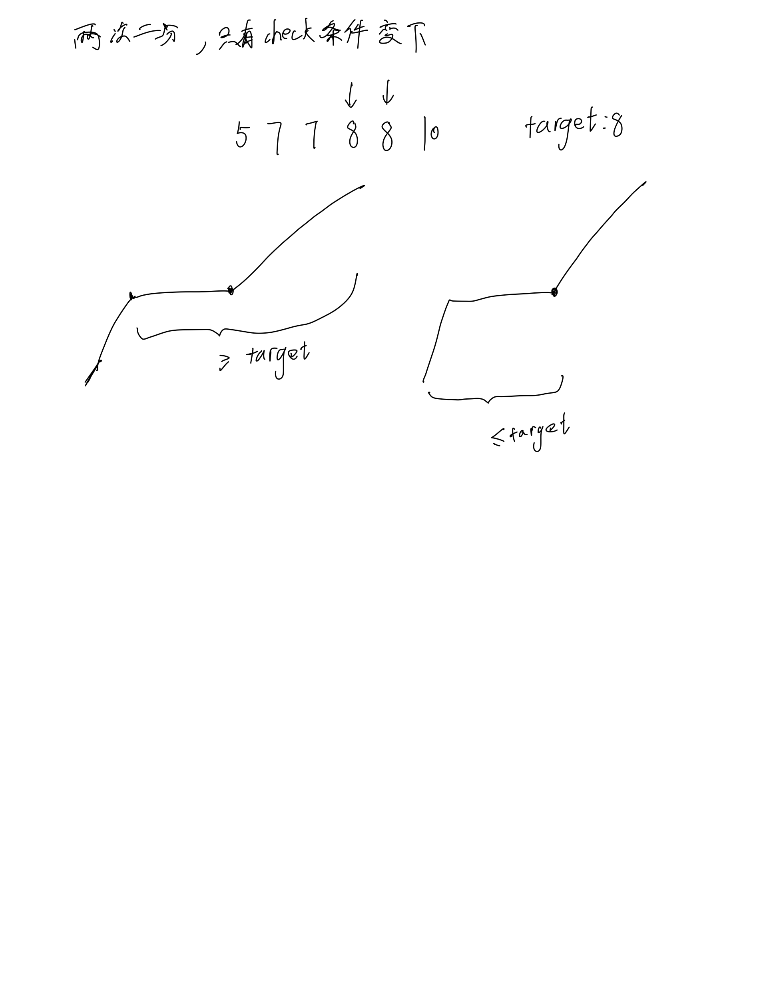

# [34. 在排序数组中查找元素的第一个和最后一个位置](https://leetcode.cn/problems/find-first-and-last-position-of-element-in-sorted-array/description/)

## 思考



## 代码

```c++
class Solution {
public:
    int find_l(vector<int>& nums, int target) {
        int l = 0, r = nums.size() - 1;
        while (l < r) {
            int mid = (l + r) / 2;
            if (nums[mid] >= target) {
                r = mid;
            } else {
                l = mid + 1;
            }
        }

        if (nums[r] == target) return r;
        else return -1;
    }

    int find_r(vector<int>& nums, int target) {
        int l = 0, r = nums.size() - 1;
        while (l < r) {
            int mid = (l + r + 1) / 2;
            if (nums[mid] <= target) {
                l = mid;
            } else {
                r = mid - 1;;
            }
        }

        if (nums[r] == target) return r;
        else return -1;
    }

    vector<int> searchRange(vector<int>& nums, int target) {
        if (nums.empty()) return {-1, -1};
        vector<int> res;
        int l = find_l(nums, target);
        int r = find_r(nums, target);
        res.emplace_back(l);
        res.emplace_back(r);

        return res;
    }
};
```
