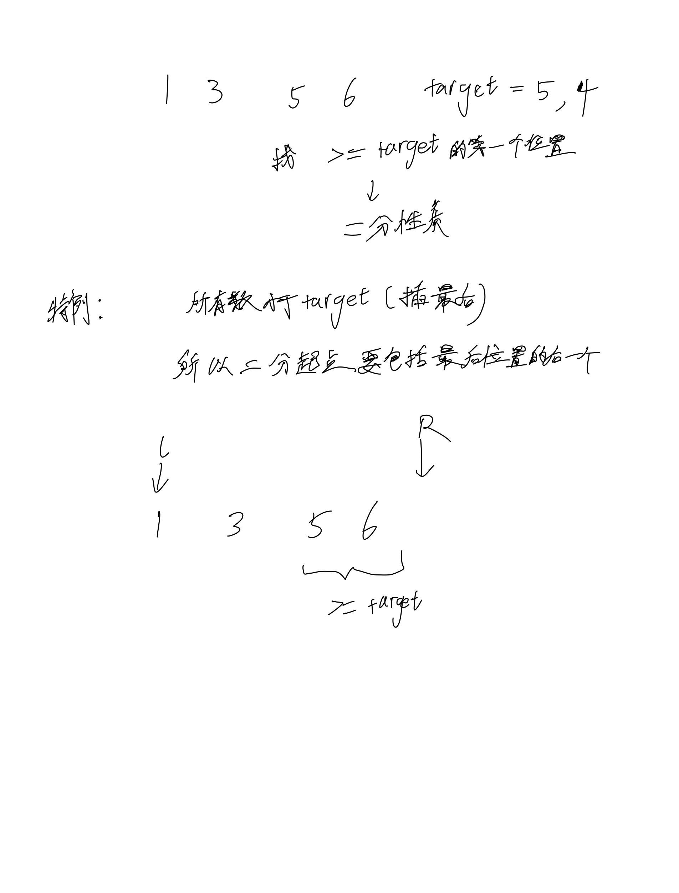

# [35. 搜索插入位置](https://leetcode.cn/problems/search-insert-position/)

## 思考

- 插入排序的优化(二分)



## 代码

```c++
class Solution {
public:
    int searchInsert(vector<int>& nums, int target) {
        int l = 0, r = nums.size();
        while (l < r) {
            int mid = (l + r) / 2;
            if (nums[mid] >= target) {
                r = mid;
            } else {
                l = mid + 1;
            }
        }

        return l;
    }
};
```
