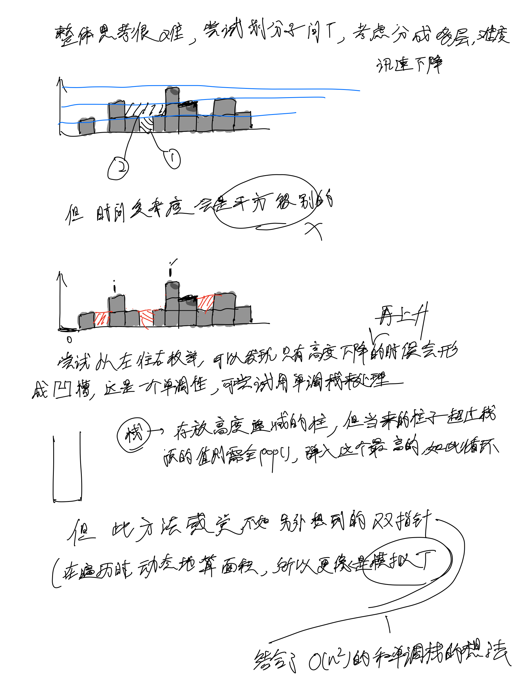
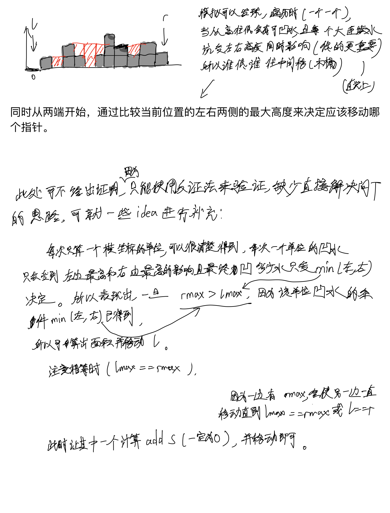
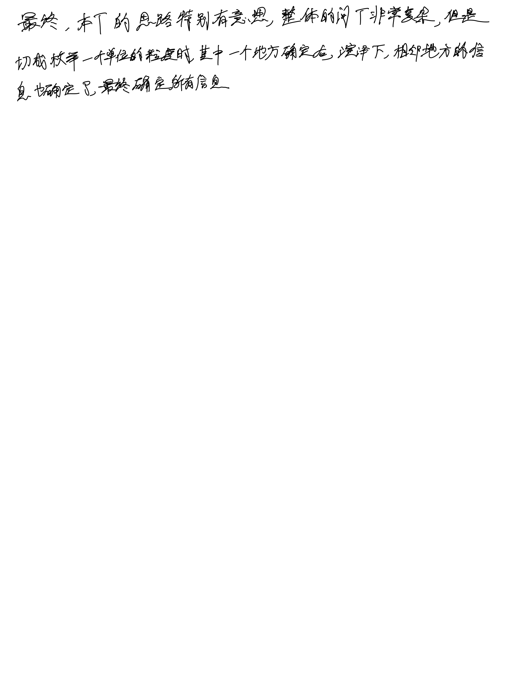

# [42. 接雨水](https://leetcode.cn/problems/trapping-rain-water/description/)

## 思考

- [leetcode题解的动图很好](https://leetcode.cn/problems/trapping-rain-water/solutions/692342/jie-yu-shui-by-leetcode-solution-tuvc)
    - 不过需要注意的是leetcode官方题解给的双指针其中比较两个柱子的大小是绕了一圈的, 且没有给出证明(虽然因为比较两个柱子可以推出lmax与rmax之间的大小关系)





## 代码

```c++
class Solution {
public:
    int trap(vector<int>& height) {
        int n = height.size();
        int l = 0, r = n - 1;
        int res = 0;
        int lmax = 0, rmax = 0;

        while (l < r) {
            lmax = max(height[l], lmax);
            rmax = max(height[r], rmax);

            if (height[l] < height[r]) {
                res += 1 * (lmax - height[l]);
                l ++;
            } else {
                res += 1 * (rmax - height[r]);
                r --;
            }
        }

        return res;
    }
};
```
