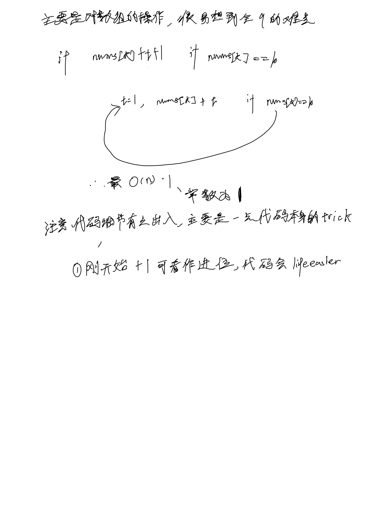

# [66. 加一](https://leetcode.cn/problems/plus-one/description/)

## 思考



## 代码

```c++
class Solution {
public:
    vector<int> plusOne(vector<int>& digits) {
        int n = digits.size();
        int k = n - 1;
        int t = 1;
        while (k >= 0) {
            int tt = digits[k] + t;
            if (tt == 10) {
                t = 1;
                digits[k] = 0;
                k --;
                continue;
            }

            digits[k] = tt;
            return digits;
        }
        if (k == -1) digits.insert(digits.begin(), 1);

        return digits;
    }
};```
