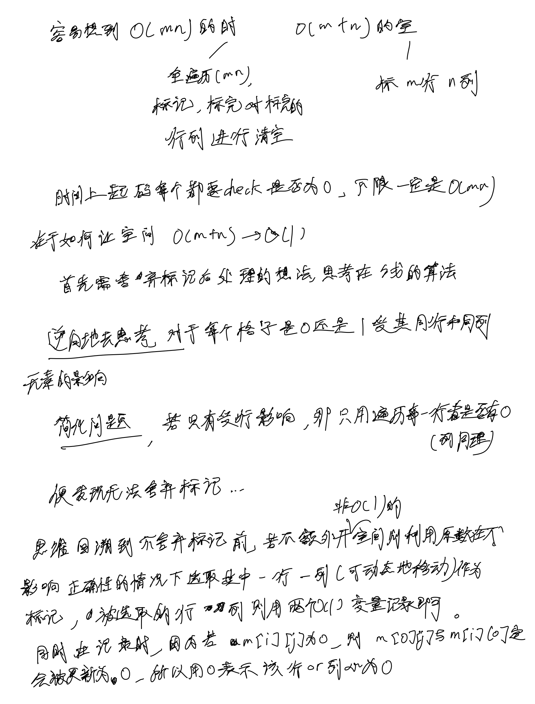

# [73. 矩阵置零](https://leetcode.cn/problems/set-matrix-zeroes/description/)

## 思考




## 代码

```c++
class Solution {
public:
    void setZeroes(vector<vector<int>>& matrix) {
        int m = matrix.size(), n = matrix[0].size();
        bool row0 = false, col0 = false;
        for (int i = 0; i < m; i ++) {
            if (!matrix[i][0]) {
                col0 = true;
            }
        }

        for (int i = 0; i < n; i ++) {
            if (!matrix[0][i]) {
                row0 = true;
            }
        }

        for (int i = 1; i < m; i ++) {
            for (int j = 1; j < n; j ++) {
                if (!matrix[i][j]) {
                    matrix[0][j] = matrix[i][0] = 0;
                }
            }
        }

        for (int i = 1; i < m; i ++) {
            if (!matrix[i][0]) {
                for (int j = 1; j < n; j ++) {
                    matrix[i][j] = 0;
                }
            }
        }

        for (int i = 1; i < n; i ++) {
            if (!matrix[0][i]) {
                for (int j = 1; j < m; j ++) {
                    matrix[j][i] = 0;
                }
            }
        }

        if (row0) {
            for (int i = 0; i < n; i ++) {
                matrix[0][i] = 0;
            }
        }

        if (col0) {
            for (int i = 0; i < m; i ++) {
                matrix[i][0] = 0;
            }
        }
    }
};
```
