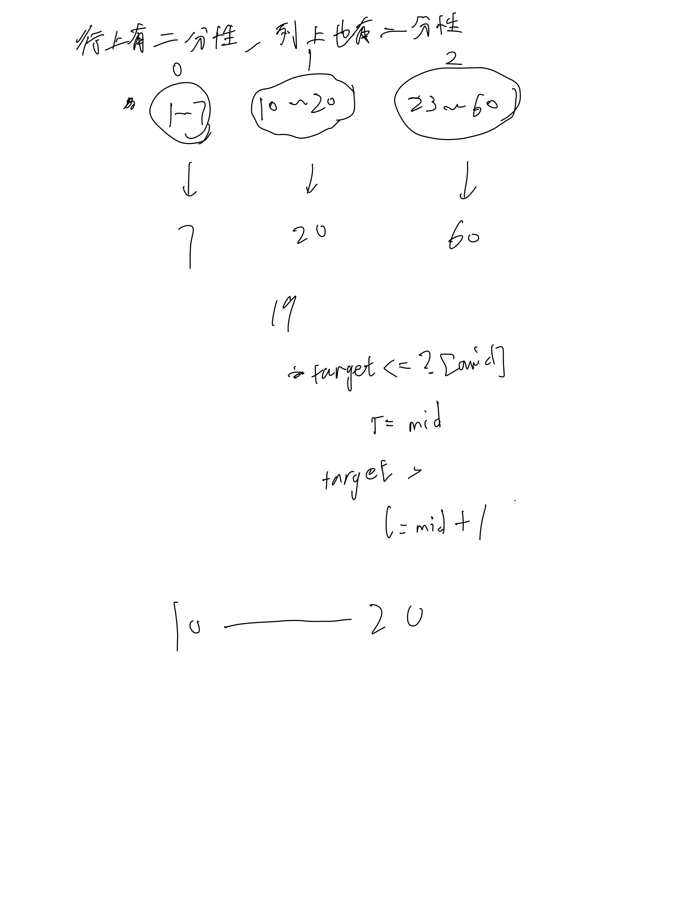
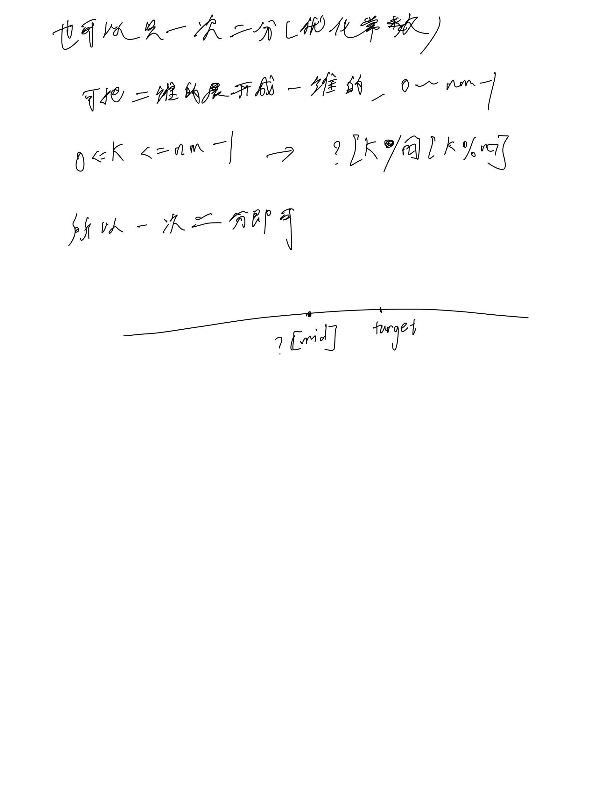

# [74. 搜索二维矩阵](https://leetcode.cn/problems/search-a-2d-matrix/description/)

## 思考




## 代码

### 两次二分

```c++
class Solution {
public:
    bool searchMatrix(vector<vector<int>>& matrix, int target) {
        int n = matrix.size(), m = matrix[0].size();
        int l = 0, r = n - 1;
        int k = 0;
        while (l < r) {
            int mid = (l + r) / 2;
            if (matrix[mid][m - 1] >= target) {
                r = mid;
            } else {
                l = mid + 1;
            }
            k = r;
        }

        int t = 0;
        l = 0, r = m - 1;
        while (l < r) {
            int mid = (l + r) / 2;
            if (matrix[k][mid] >= target) {
                r = mid;
            } else {
                l = mid + 1;
            }
            t = r;
        }

        if (matrix[k][t] == target) return true;
        return false;
    }
};
```

### 一次二分

```c++
class Solution {
public:
    bool searchMatrix(vector<vector<int>>& matrix, int target) {
        int n = matrix.size(), m = matrix[0].size();
        int l = 0, r = n * m - 1;
        while (l < r) {
            int mid = (l + r + 1) / 2;
            if (matrix[mid / m][mid % m] <= target) {
                l = mid;
            } else {
                r = mid - 1;
            }
        }

        if (matrix[r / m][r % m] == target) return true;
        return false;
    }
};
```
