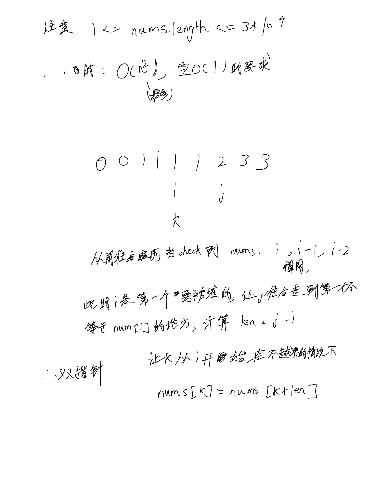
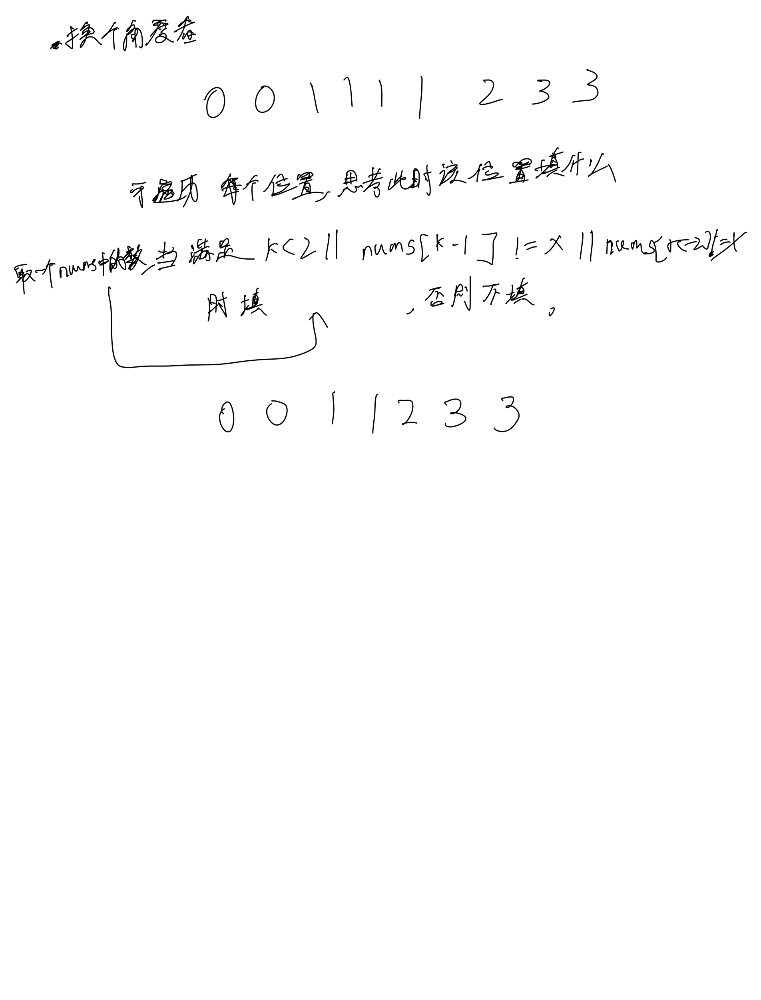

# [80. 删除有序数组中的重复项 II](https://leetcode.cn/problems/remove-duplicates-from-sorted-array-ii/description/)

## 思考




## 代码

### 双指针(不是最好)

```c++
class Solution {
public:
    int removeDuplicates(vector<int>& nums) {
        int n = nums.size();
        for (int i = 0; i < n; i ++) {
            if (i > 1 && nums[i] == nums[i - 1] && nums[i - 1] == nums[i - 2]) {
                int t = nums[i];
                int j = i;
                while (j < n && nums[j] == nums[i]) {
                    j ++;
                }
                int len = j - i;
                for (int k = i; k + len < n; k ++) {
                    nums[k] = nums[k + len];
                }
                n -= len;
            }
        }
        return n;
    }
};
```

## 遍历

```c++
class Solution {
public:
    int removeDuplicates(vector<int>& nums) {
        int n = nums.size();
        int k = 0;
        for (int i = 0; i < n; i ++) {
            int t = nums[i];
            if (k < 2 || nums[k - 1] != t || nums[k - 2] != t) {
                nums[k] = t;
                k ++;
            }
        }
        return k;
    }
};
```
