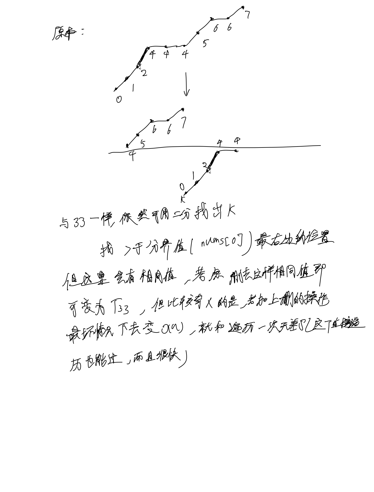

# [81. 搜索旋转排序数组 II](https://leetcode.cn/problems/search-in-rotated-sorted-array-ii/description/)

## 思考



## 代码

```c++
class Solution {
public:
    int delete_nums(const vector<int> &nums, const int target) {
        int k = nums.size() - 1;
        while (k && nums[k] == nums[0]) {
            k --;
        }
        return k;
    }

    int find_boundary(const vector<int> &nums, const int target, int l, int r) {
        int n = nums.size();
        while (l < r) {
            int mid = (l + r + 1) / 2;
            if (nums[mid] >= nums[0]) {
                l = mid;
            } else {
                r = mid - 1;
            }
        }

        return r;
    }

    void update_boundary(const vector<int> &nums, const int target, int &l, int &r, int b) {
        if (target >= nums[0]) {
            r = b;
        } else {
            l = b + 1;
        }
    }

    bool find_target(const vector<int> &nums, const int target, int l, int r) {
        while (l < r) {
            int mid = (l + r + 1) / 2;
            if (nums[mid] <= target) {
                l = mid;
            } else {
                r = mid - 1;
            }
        }

        if (nums[r] == target) return true;
        return false;
    }
    
    bool search(vector<int>& nums, int target) {
        int n = nums.size();

        int l = 0, r = delete_nums(nums, target);
        if (r == 0) {
            return nums[0] == target;
        }

        int k = find_boundary(nums, target, l, r);

        update_boundary(nums, target, l, r, k);

        return find_target(nums, target, l, r);
    }
};
```
