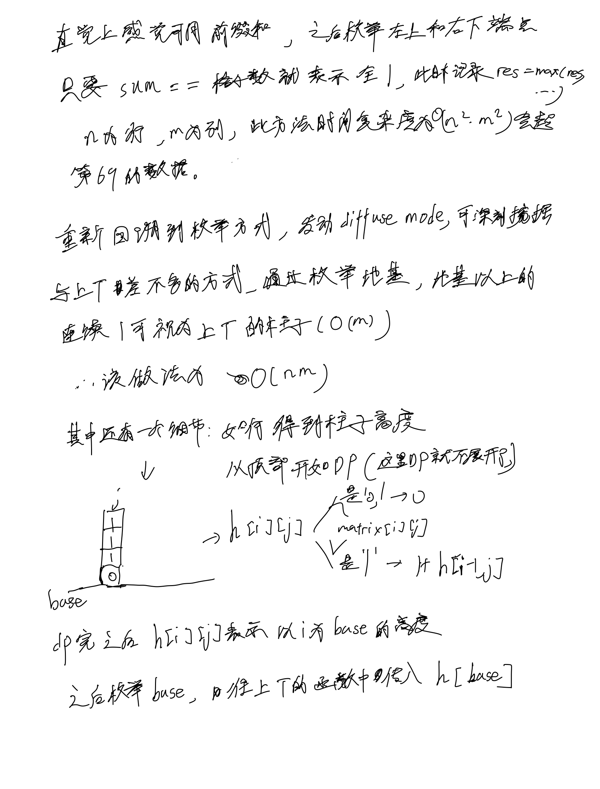

# [85. 最大矩形](https://leetcode.cn/problems/maximal-rectangle/description/)

## 思考

- 注意此题的降维方法和当年我参加蓝桥杯统计子矩阵优化思路是一样的, 该降维思路建议是背下



## 代码

```c++
class Solution {
public:
    int largestRectangleArea(vector<int>& h) {
        int n = h.size();
        vector<int> left(n), righjt(n);
        vector<int> stack;

        for (int i = 0; i < n; i ++) {
            int t = h[i];
            while (!stack.empty() && t <= h[stack.back()]) {
                stack.pop_back();
            }
            if (stack.empty()) left[i] = -1;
            else left[i] = stack.back();
            stack.emplace_back(i);
        }

        stack = vector<int>();
        for (int i = n - 1; i >= 0; i --) {
            int t = h[i];
            while (!stack.empty() && t <= h[stack.back()]) {
                stack.pop_back();
            }
            if (stack.empty()) righjt[i] = n;
            else righjt[i] = stack.back();
            stack.emplace_back(i);
        }

        int res = 0;
        for (int i = 0; i < n; i ++) {
            int t = h[i] * (righjt[i] - left[i] - 1);
            res = max(res, t);
        }

        return res;
    }

    int maximalRectangle(vector<vector<char>>& matrix) {
        int n = matrix.size(), m = matrix[0].size();
        vector<vector<int>> h(n, vector<int>(m));
        for (int i = 0; i < m; i ++) {
            h[0][i] = matrix[0][i] - '0';
        }

        for (int i = 1; i < n; i ++) {
            for (int j = 0;j < m; j ++) {
                if (matrix[i][j] == '1') {
                    h[i][j] = 1 + h[i - 1][j];
                }
            }
        }

        int res = 0;
        for (int i = 0; i < n; i ++) {
            res = max(res, largestRectangleArea(h[i]));
        }

        return res;
    }
};
```
