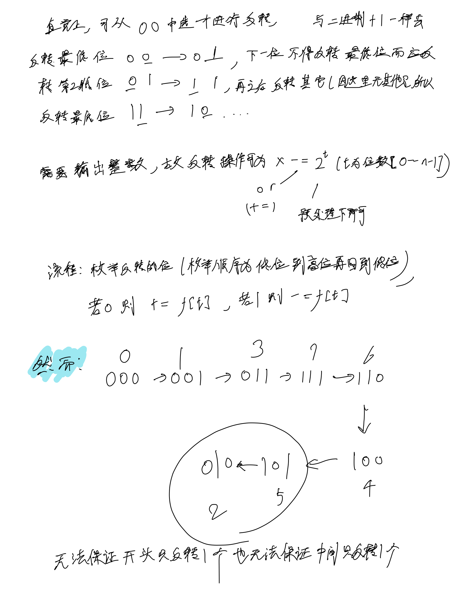
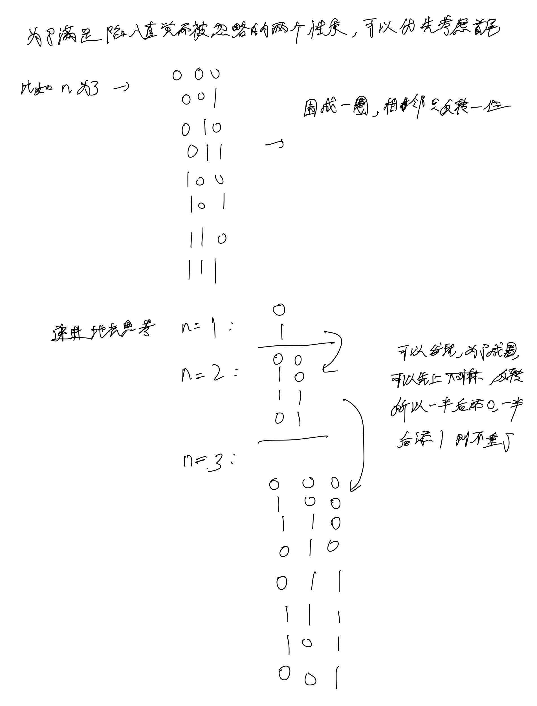
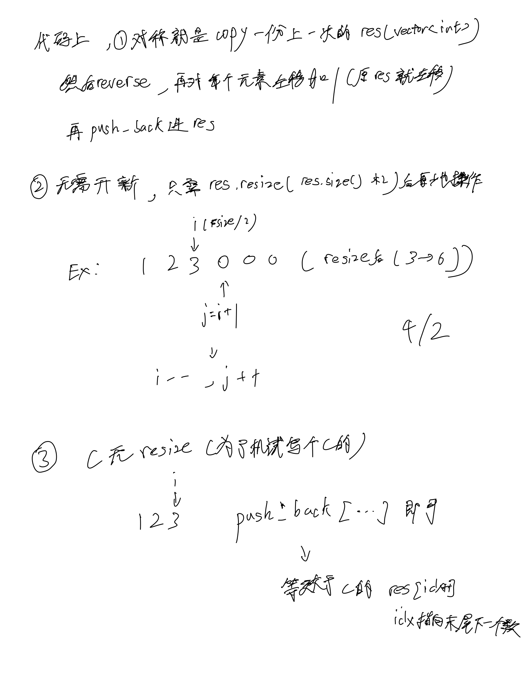

# [89. 格雷编码](https://leetcode.cn/problems/gray-code/description/)

## 思考





## 代码

```c++
class Solution {
public:
    vector<int> grayCode(int n) {
        vector<int> res(2, 0);
        res[1] = 1;
        n --;
        
        while (n --) {
            for (int i = res.size() - 1; i >= 0; i --) {
                res[i] <<= 1;
                res.emplace_back(res[i] + 1);
            }
        }

        return res;
    }
};```
