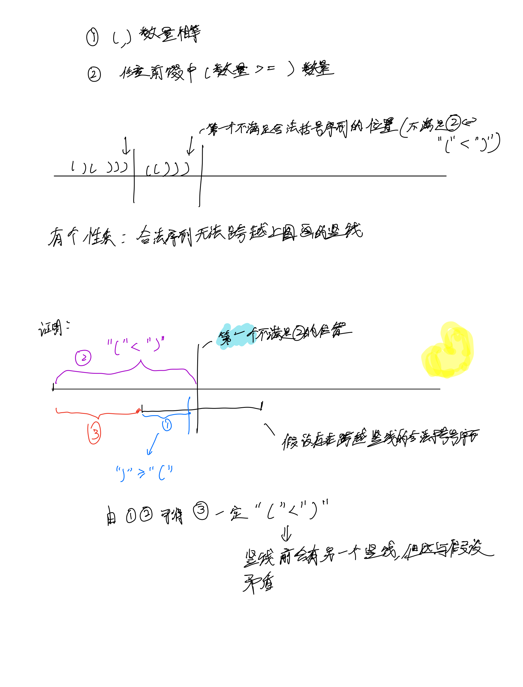
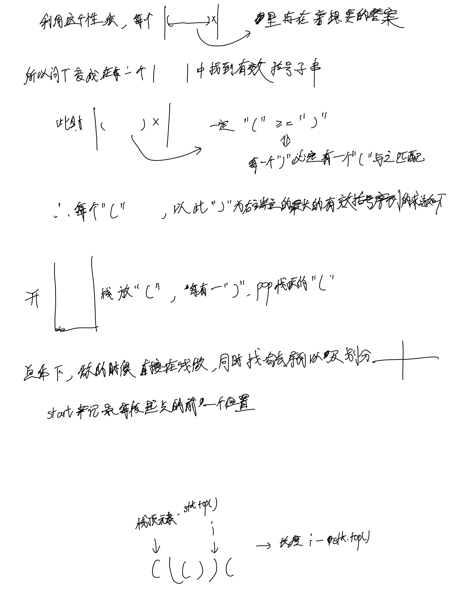

# [32. 最长有效括号](https://leetcode.cn/problems/longest-valid-parentheses/description/)

## 思考




## 代码

```c++
class Solution {
public:
    int longestValidParentheses(string s) {
        stack<int> stk;
        int res = 0;
        // start是每个区间的前一个位置
        for (int i = 0, start = -1; i < s.size(); i ++) {
            if (s[i] == '(') {
                stk.push(i);
            } else {
                // 如果栈顶有元素就pop对应的这个"("
                if (stk.size()) {
                    stk.pop();
                    // 如果栈顶还有元素就记录这个长度
                    if (stk.size()) {
                        res = max(res, i - stk.top());
                    } else { // 没有就用start来算长度
                        res = max(res, i - start);
                    }   
                } else { // 此时右括号数量大于左括号, 说明到了新区间, 更新下start为新区间起点左边一个位置
                    start = i;
                }
            }
        }
        return res;
    }
};
```
