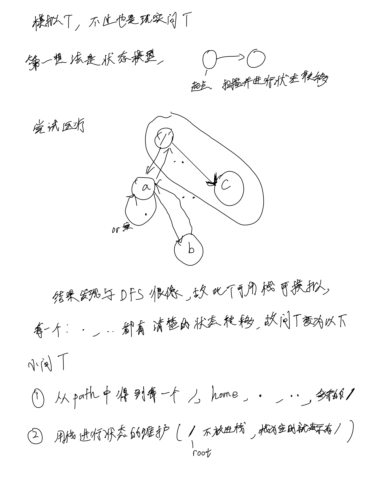
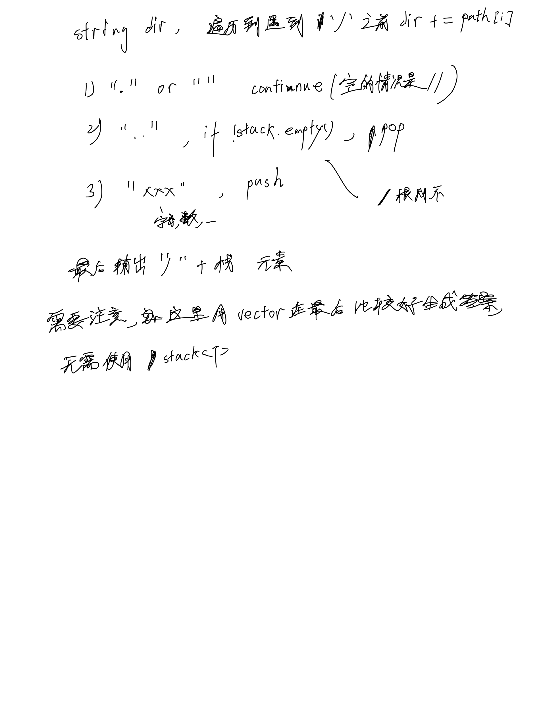

# [71. 简化路径](https://leetcode.cn/problems/simplify-path/description/)

## 思考




## 代码

```c++
class Solution {
public:
    string simplifyPath(string path) {
        int n = path.size();
        vector<string> stack;
        for (int i = 0; i < n;) {
            int j = i;
            string dir;

            while (j < n && path[j] != '/') {
                dir += path[j];
                j ++;
            }

            if (dir == "." || dir == "") {
                i ++;
                continue;
            }

            if (dir == "..") {
                if (!stack.empty()) stack.pop_back();
                i ++;
                continue;
            }

            stack.emplace_back(dir);
            dir = "";
            i = j + 1;
        }

        string s = "";
        for (string t : stack) {
            s += "/" + t;
        }
        if (s.empty()) return "/";

        return s;
    }
};
```
