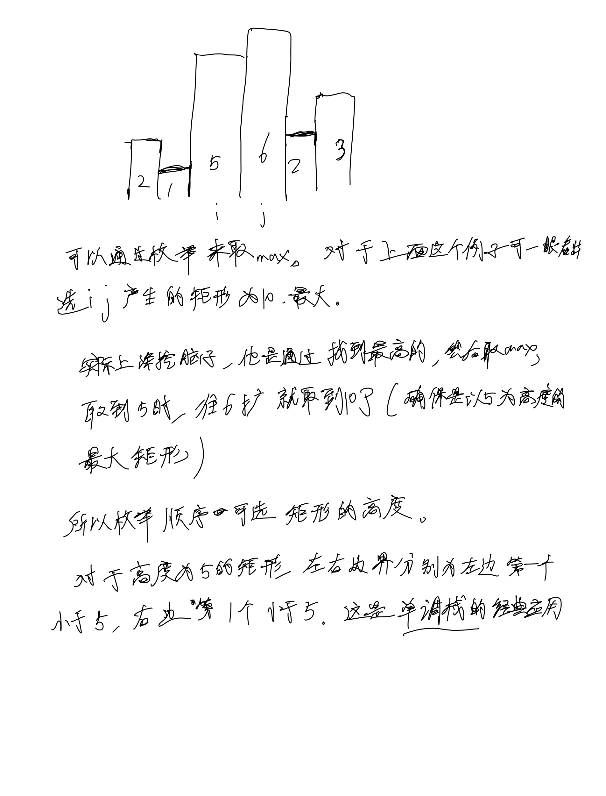
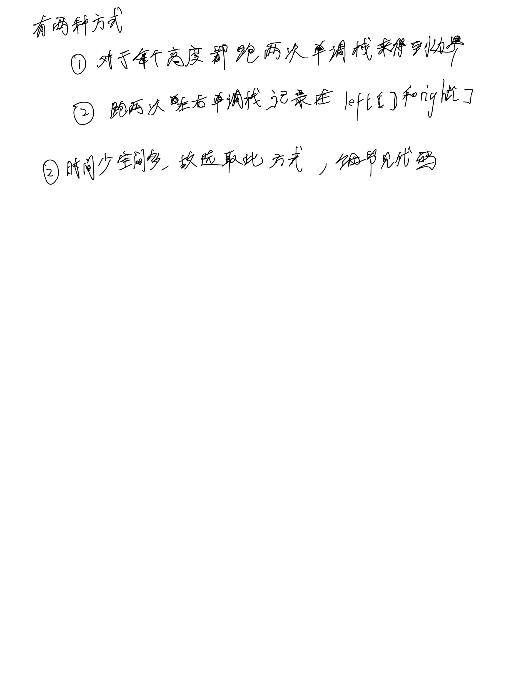

# [84. 柱状图中最大的矩形](https://leetcode.cn/problems/largest-rectangle-in-histogram/description/)

## 思考




## 代码

```c++
class Solution {
public:
    int largestRectangleArea(vector<int>& h) {
        int n = h.size();
        vector<int> left(n), righjt(n);
        vector<int> stack;

        for (int i = 0; i < n; i ++) {
            int t = h[i];
            while (!stack.empty() && t <= h[stack.back()]) {
                stack.pop_back();
            }
            if (stack.empty()) left[i] = -1;
            else left[i] = stack.back();
            stack.emplace_back(i);
        }

        stack = vector<int>();
        for (int i = n - 1; i >= 0; i --) {
            int t = h[i];
            while (!stack.empty() && t <= h[stack.back()]) {
                stack.pop_back();
            }
            if (stack.empty()) righjt[i] = n;
            else righjt[i] = stack.back();
            stack.emplace_back(i);
        }

        int res = 0;
        for (int i = 0; i < n; i ++) {
            int t = h[i] * (righjt[i] - left[i] - 1);
            res = max(res, t);
        }

        return res;
    }
};
```
