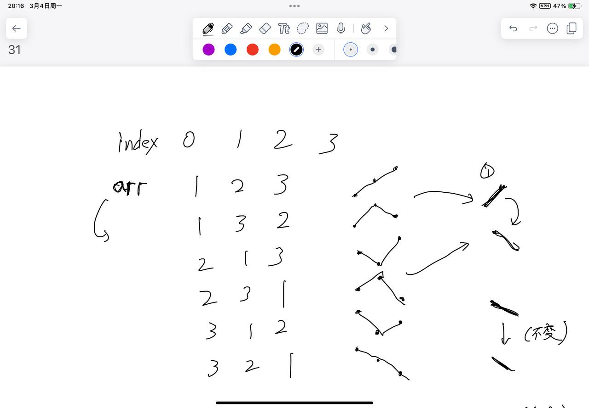
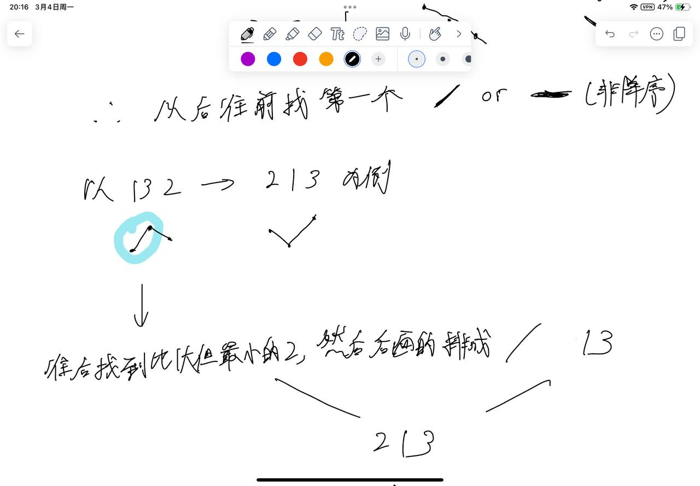
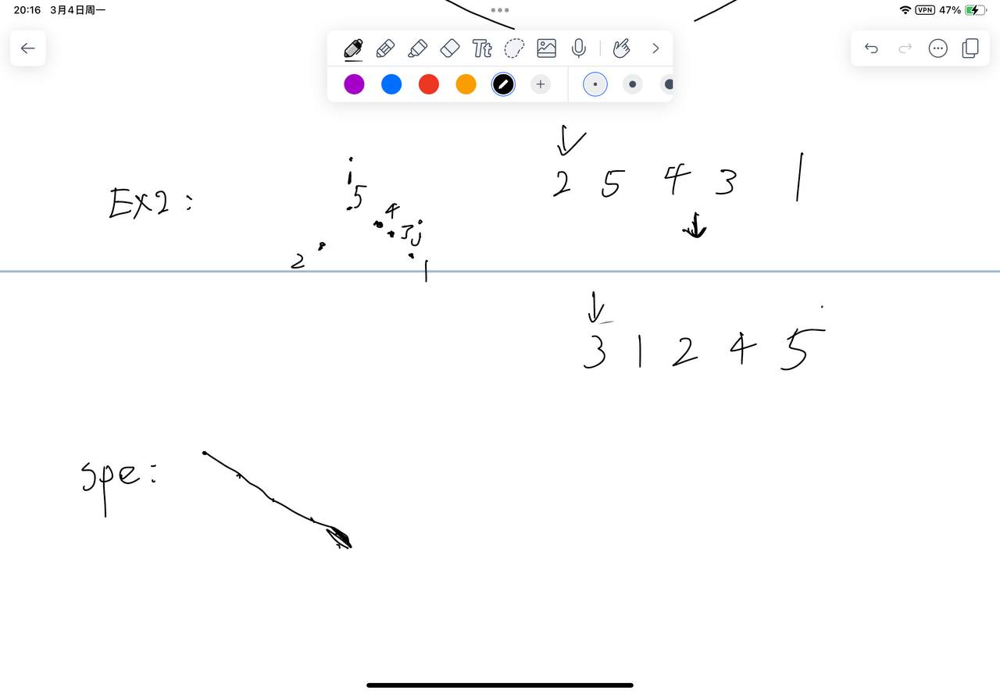

# [31. 下一个排列](https://leetcode.cn/problems/next-permutation/description/)

## 思考





## 代码

```c++
class Solution {
public:
    void nextPermutation(vector<int>& nums) {
        int n = nums.size();
        int i = n - 1;
        while (i && nums[i] <= nums[i - 1]) i --;
        if (i <= 0) {
            reverse(nums.begin(), nums.end());
            return;
        }
        int j = i + 1;
        while (j < n && nums[j] > nums[i - 1]) j ++;
        swap(nums[i - 1], nums[j - 1]);
        reverse(nums.begin() + i, nums.end());
    }
};
```
