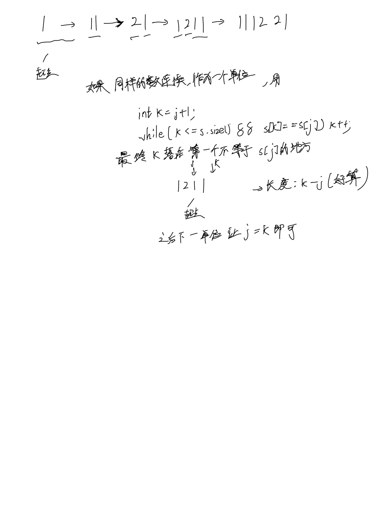

# [38. 外观数列](https://leetcode.cn/problems/count-and-say/description/)

## 思考



## 代码

```c++
class Solution {
public:
    string countAndSay(int n) {
        if (n == 1) {
            return "1";
        }
        
        string s = "1";
        for (int i = 0; i < n - 1; i ++) {
            string t = "";
            for (int j = 0; j < s.size();) {
                int k = j + 1;
                while (k < s.size() && s[j] == s[k]) k ++;
                t += to_string(k - j) + s[j];
                j = k;
            }
            s = t;
        }

        return s;
    }
};
```
