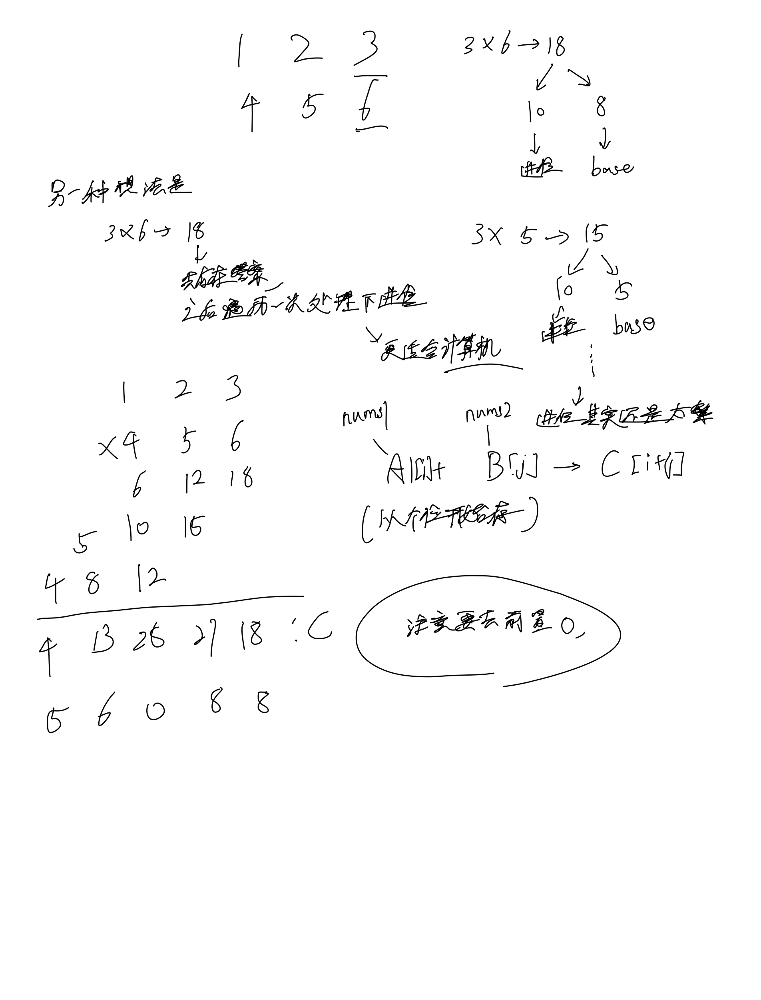

# [43. 字符串相乘](https://leetcode.cn/problems/multiply-strings/)

## 思考

- 本质应该是模拟题, 模拟手动做乘法的计算思维细节



## 代码

```c++
class Solution {
public:
    string multiply(string num1, string num2) {
        vector<int>A, B;
        int n = num1.size(), m = num2.size();
        for (int i = n - 1; i >= 0; i --) A.emplace_back(num1[i] - '0');
        for (int i = m - 1; i >= 0; i --) B.emplace_back(num2[i] - '0');
        vector<int>C(n + m);

        for (int i = 0; i < B.size(); i ++) {
            for (int j = 0; j < A.size(); j ++) {
                C[i + j] += B[i] * A[j];
            }
        }

        // t的循环不变量意义是来自于上次loop产生的进位
        // 中间t作为暂存器
        for (int i = 0, t = 0; i < C.size(); i ++) {
            t += C[i];
            C[i] = t % 10;
            t /= 10;
        }

        // 细节上处理了k到0这个位置即使是0也不继续k--, 不需要特判
        // k的循环不变量最终落在最后一个不是0的位置
        int k = C.size() - 1;
        while (k && !C[k]) k --;

        string res = "";
        for (int i = k; i >= 0; i --) {
            res += C[i] + '0';
        }

        return res;
    }
};
```
