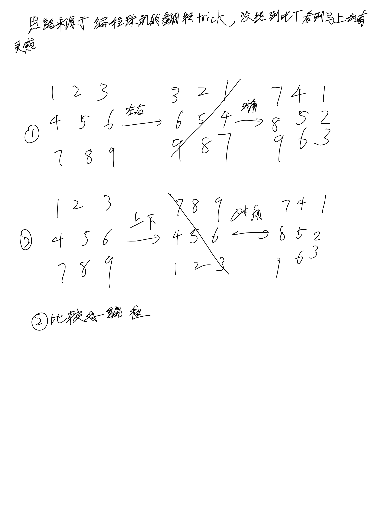

# [48. 旋转图像](https://leetcode.cn/problems/rotate-image/description/) 

## 思考



## 代码

```c++
class Solution {
public:
    void rotate(vector<vector<int>>& matrix) {
        int n = matrix.size();
        reverse(matrix.begin(), matrix.end());

        for (int i = 0; i < n; i ++) {
            for (int j = 0; j < i; j ++) {
                swap(matrix[i][j], matrix[j][i]);
            }
        }
    }
};
```
