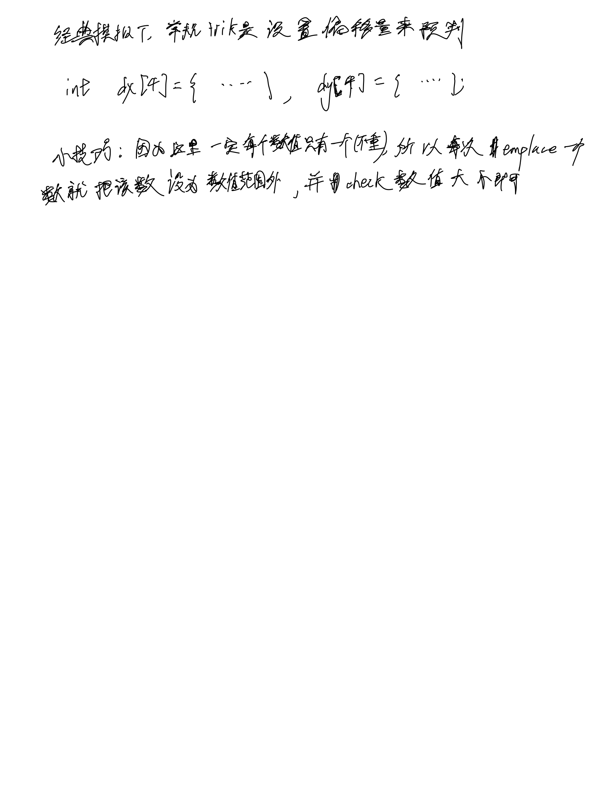

# [54. 螺旋矩阵](https://leetcode.cn/problems/spiral-matrix/description/)

## 思考



## 代码

```c++
class Solution {
public:
    vector<int> spiralOrder(vector<vector<int>>& matrix) {
        vector<int> res;
        int dx[4] = {0, 1, 0, -1}, dy[4] = {1, 0, -1, 0};
        int n = matrix.size(), m = matrix[0].size();
        vector<vector<bool>> st(n, vector<bool>(m));
        
        int cnt =  n * m;
        int x = 0, y = 0, idx = 0;
        while (true) {
            res.emplace_back(matrix[x][y]);
            matrix[x][y] = 101;
            cnt --;
            if (cnt == 0) break;

            int a = x + dx[idx], b = y + dy[idx];
            while (a < 0 || a >= n || b < 0 || b >= m || matrix[a][b] > 100) {
                idx ++;
                idx %= 4;
                a = x + dx[idx], b = y + dy[idx];
            }
            
            x = a, y = b;
        }

        return res;
    }
};
```
