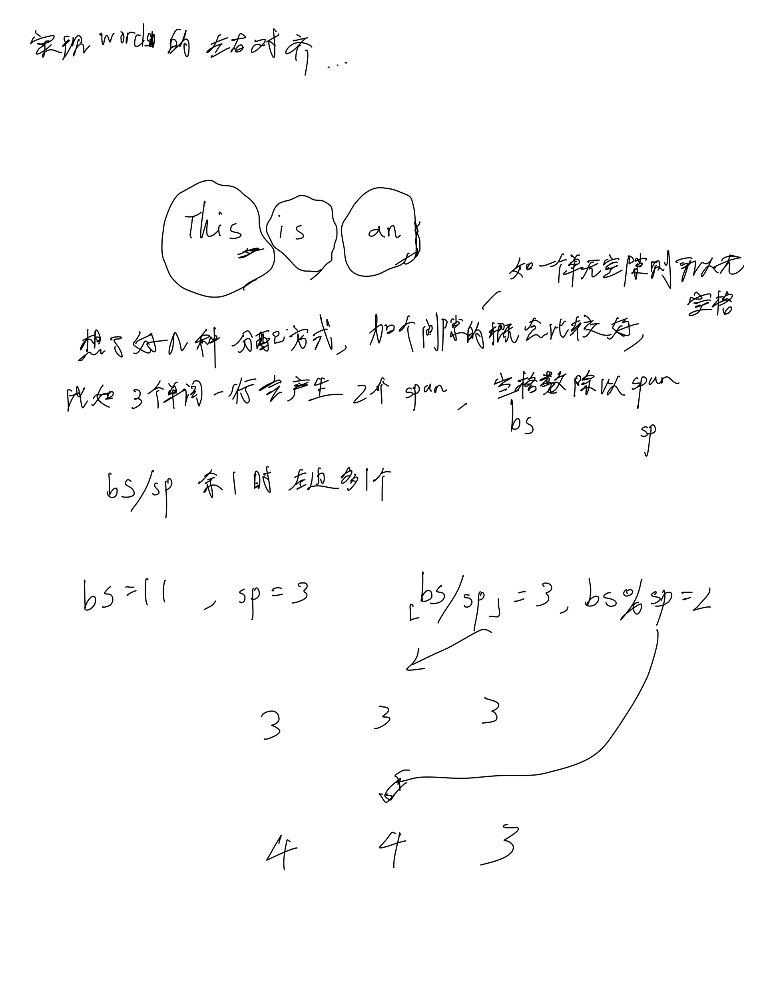
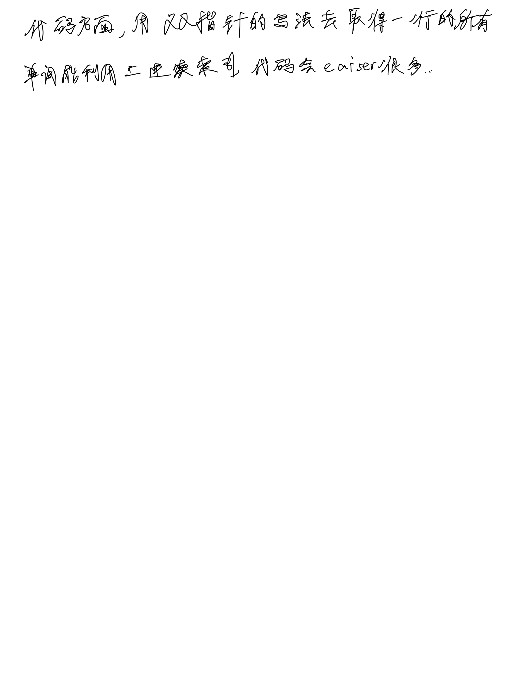

# [68. 文本左右对齐](https://leetcode.cn/problems/text-justification/description/)

## 思考





## 代码

```c++
class Solution {
public:
    vector<string> fullJustify(vector<string>& words, int maxWidth) {
        vector<string> res;
        int n = words.size();
        for (int i = 0; i < n;) {
            int sum = words[i].size();
            int j = i + 1;
            while (j < n && sum + 1 + words[j].size() <= maxWidth) {
                sum += 1 + words[j].size();
                j ++;
            }

            string s;
            if (j == i + 1 || j == n) {
                s += words[i];
                for (int k = i + 1; k < j; k ++) {
                    s += " " + words[k];
                }
                s += string(maxWidth - sum, ' ');
            } else {
                int cnt = j - i; // words cnt
                int span = cnt - 1; // words cnt minus one
                int bs = maxWidth - sum + span;
                int base = bs / span;
                int add = bs % span;

                s += words[i];
                for (int k = i + 1; k < j; k ++) {
                    s += string(base, ' ');
                    if (add) {
                        add --;
                        s += " ";
                    }
                    s += words[k];
                }
            }

            res.emplace_back(s);
            i = j;
        }

        return res;
    }
};
```
