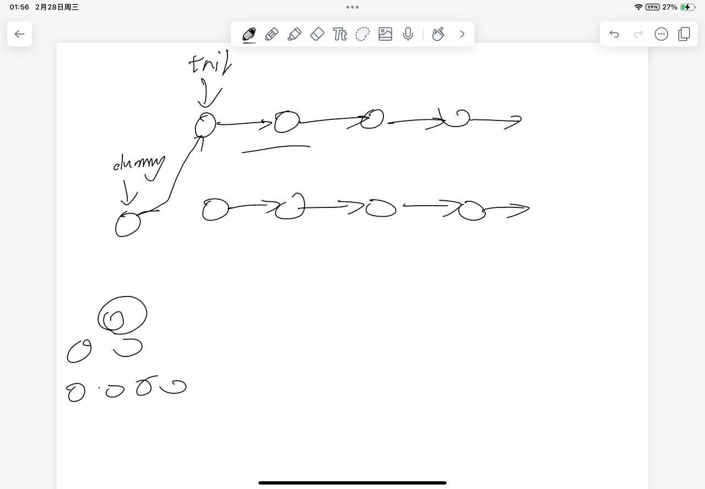

# [23. 合并 K 个升序链表](https://leetcode.cn/problems/merge-k-sorted-lists/description/) 

## 思考

- 和21的思路差不多, 不过因为是k条, 需要优化下找最小值的操作
- 比较常用的动态的方式是用堆
- 这里的小根堆的语法必须要搞懂
- 像这种数据结构存储指针是比较好的习惯(通常leetcode的链表都是分配在堆里的(new的)所以有头节点指针就可以)



## 代码

```c++
/**
 * Definition for singly-linked list.
 * struct ListNode {
 *     int val;
 *     ListNode *next;
 *     ListNode() : val(0), next(nullptr) {}
 *     ListNode(int x) : val(x), next(nullptr) {}
 *     ListNode(int x, ListNode *next) : val(x), next(next) {}
 * };
 */
class Solution {
public:

    struct Cmp {
        bool operator() (ListNode* a, ListNode* b) {
            return a->val > b->val;
        }
    };

    ListNode* mergeKLists(vector<ListNode*>& lists) {
        ListNode* dummy = new ListNode(-1), *tail = dummy;
        priority_queue<ListNode*, vector<ListNode*>, Cmp> heap;
        for (ListNode* p : lists) {
            if (p) {
                heap.push(p);
            }
        }
        while (heap.size()) {
            ListNode* p = heap.top();
            heap.pop();
            tail->next = p;
            tail = p;
            if (p->next) heap.push(p->next);
        }
        return dummy->next;
    }
    
};
```
