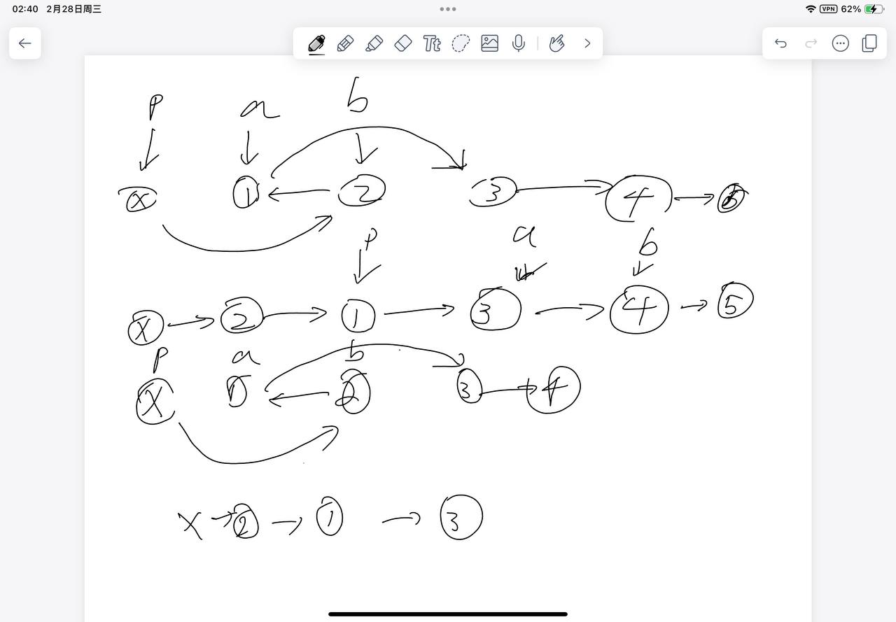

# [24. 两两交换链表中的节点](https://leetcode.cn/problems/swap-nodes-in-pairs/description/)

## 思考

- head会改变, 所以有dummy会好
- 每次交换两个, 所以用迭代即可
- p每次都指向要将换的两个节点前一个节点
- 然后找到不断链的交换方式即可, 然后p再迭代到下一个位置
- 

## 代码

```c++
/**
 * Definition for singly-linked list.
 * struct ListNode {
 *     int val;
 *     ListNode *next;
 *     ListNode() : val(0), next(nullptr) {}
 *     ListNode(int x) : val(x), next(nullptr) {}
 *     ListNode(int x, ListNode *next) : val(x), next(next) {}
 * };
 */
class Solution {
public:
    ListNode* swapPairs(ListNode* head) {
        ListNode* dummy = new ListNode(-1);
        dummy->next = head;
        ListNode* p = dummy;
        while (p->next && p->next->next) {
            ListNode* a = p->next, *b = a->next;
            p->next = b;
            a->next = b->next;
            b->next = a;
            
            p = a;
        }
        return dummy->next;
    }
};
```
