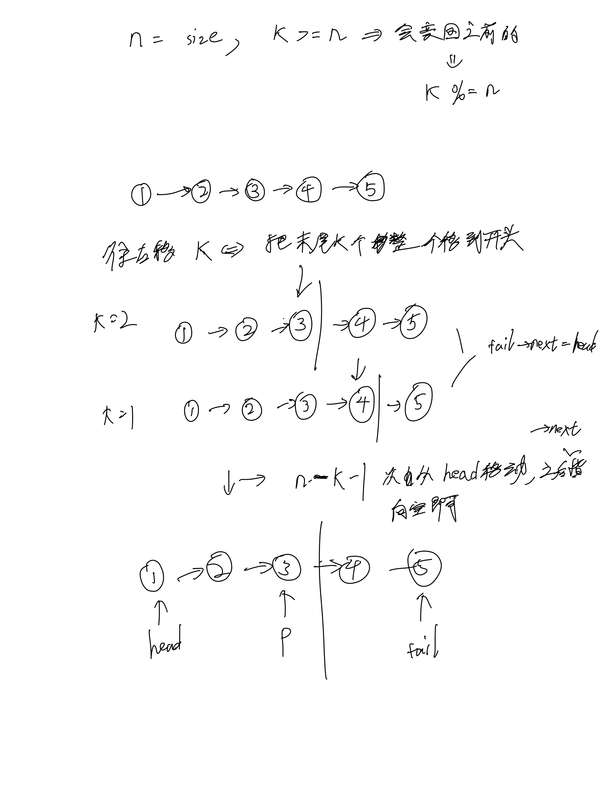

# [61. 旋转链表](https://leetcode.cn/problems/rotate-list/description/)

## 思考



## 代码

```c++
/**
 * Definition for singly-linked list.
 * struct ListNode {
 *     int val;
 *     ListNode *next;
 *     ListNode() : val(0), next(nullptr) {}
 *     ListNode(int x) : val(x), next(nullptr) {}
 *     ListNode(int x, ListNode *next) : val(x), next(next) {}
 * };
 */
class Solution {
public:
    ListNode* rotateRight(ListNode* head, int k) {
        if (!head) return head;
        int n = 0;
        ListNode* tail;
        for (ListNode* p = head; p; p = p->next) {
            n ++;
            if (p->next == NULL) tail = p;
        }

        k %= n;
        if (k == 0) return head;
        
        ListNode* p = head;
        for (int i = 0; i < n - k - 1; i ++) {
            p = p->next;  
        }

        tail->next = head;
        head = p->next;
        p->next = NULL;

        return head;
    }
};
```
