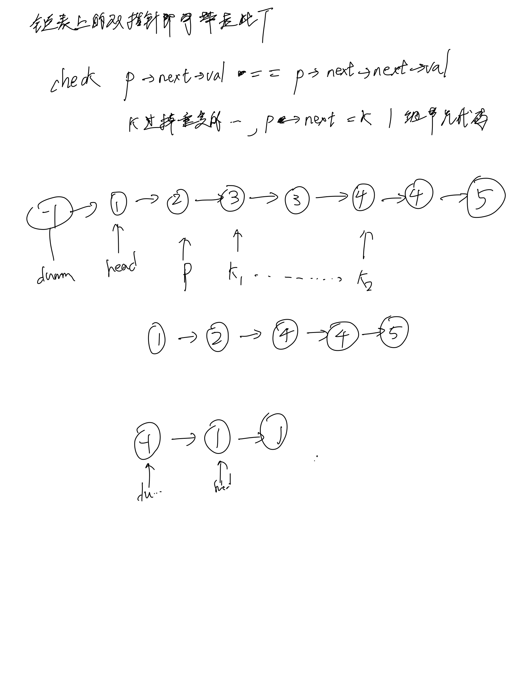

# [82. 删除排序链表中的重复元素 II](https://leetcode.cn/problems/remove-duplicates-from-sorted-list-ii/description/)

## 思考



## 代码

```c++
/**
 * Definition for singly-linked list.
 * struct ListNode {
 *     int val;
 *     ListNode *next;
 *     ListNode() : val(0), next(nullptr) {}
 *     ListNode(int x) : val(x), next(nullptr) {}
 *     ListNode(int x, ListNode *next) : val(x), next(next) {}
 * };
 */
class Solution {
public:
    ListNode* deleteDuplicates(ListNode* head) {
        ListNode* dummy = new ListNode(-1);
        dummy->next = head;
        for (ListNode* p = dummy; p->next && p->next->next;) {
            if (p->next->val == p->next->next->val) {
                ListNode* k = p->next;
                while (k && k->val == p->next->val) {
                    k = k->next;
                }
                p->next = k;
            } else {
                p = p->next;
            }
        }

        return dummy->next;
    }
};
```
