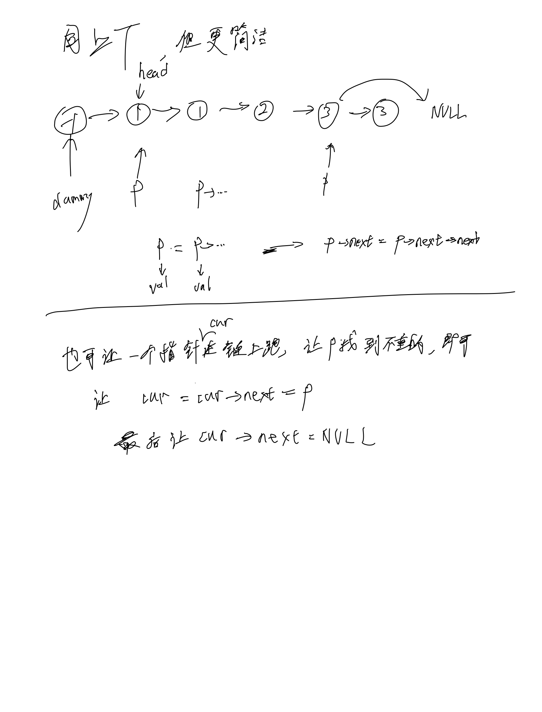

# [83. 删除排序链表中的重复元素](https://leetcode.cn/problems/remove-duplicates-from-sorted-list/)

## 思考



## 代码

#### 同82

```c++
/**
 * Definition for singly-linked list.
 * struct ListNode {
 *     int val;
 *     ListNode *next;
 *     ListNode() : val(0), next(nullptr) {}
 *     ListNode(int x) : val(x), next(nullptr) {}
 *     ListNode(int x, ListNode *next) : val(x), next(next) {}
 * };
 */
class Solution {
public:
    ListNode* deleteDuplicates(ListNode* head) {
        ListNode* dummy = new ListNode(-1000);
        dummy->next = head;
        for (ListNode* p = dummy; p; p = p->next) {
            // DEBUG: cout << p->val << endl;
            while (p->next && p->val == p->next->val) {
                p->next = p->next->next;
            }
        }

        return dummy->next;
    }
};
```

#### 链上跑

```c++
/**
 * Definition for singly-linked list.
 * struct ListNode {
 *     int val;
 *     ListNode *next;
 *     ListNode() : val(0), next(nullptr) {}
 *     ListNode(int x) : val(x), next(nullptr) {}
 *     ListNode(int x, ListNode *next) : val(x), next(next) {}
 * };
 */
class Solution {
public:
    ListNode* deleteDuplicates(ListNode* head) {
        ListNode* dummy = new ListNode(-100);
        dummy->next = head;
        ListNode* cur = dummy;
        for (ListNode* p = head; p; p = p->next) {
            if (cur->val != p->val) {
                cur = cur->next = p;
            }
        }
        cur->next = NULL;

        return dummy->next;
    }
};
```
