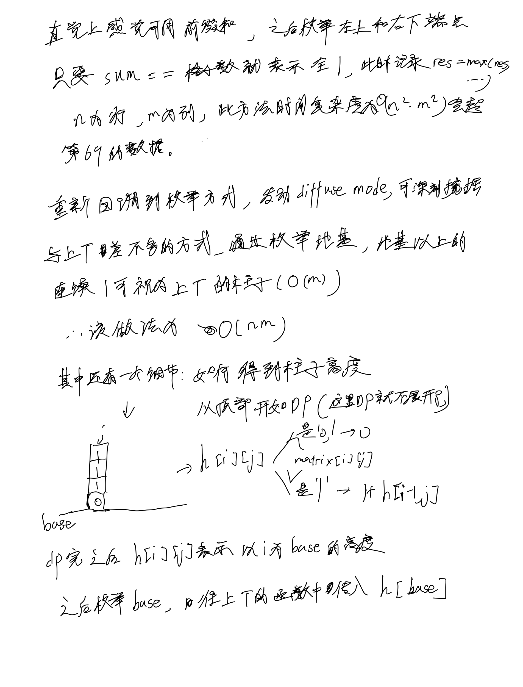

# [86. 分隔链表](https://leetcode.cn/problems/partition-list/description/)

## 思考



## 代码

```c++
/**
 * Definition for singly-linked list.
 * struct ListNode {
 *     int val;
 *     ListNode *next;
 *     ListNode() : val(0), next(nullptr) {}
 *     ListNode(int x) : val(x), next(nullptr) {}
 *     ListNode(int x, ListNode *next) : val(x), next(next) {}
 * };
 */
class Solution {
public:
    ListNode* partition(ListNode* head, int x) {
        ListNode* dummy1 = new ListNode(-101);
        ListNode* dummy2 = new ListNode(-101);
        dummy1->next = head;
        dummy2->next = head;

        ListNode* small = dummy1;
        ListNode* big = dummy2;
        for (ListNode* p = head; p; p = p->next) {
            if (p->val < x) {
                small = small->next = p;
            } else {
                big = big->next = p;
            }
        }

        big->next = NULL;
        small->next = dummy2->next;

        return dummy1->next;
    }
};
```
