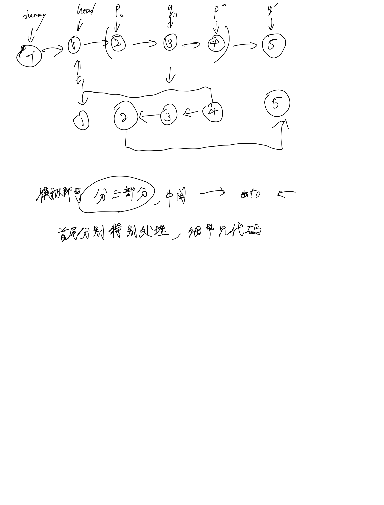

# [92. 反转链表 II](https://leetcode.cn/problems/reverse-linked-list-ii/description/https://leetcode.cn/problems/reverse-linked-list-ii/description/)

## 思考



## 代码

### 模拟

#### C++

```c++
/**
 * Definition for singly-linked list.
 * struct ListNode {
 *     int val;
 *     ListNode *next;
 *     ListNode() : val(0), next(nullptr) {}
 *     ListNode(int x) : val(x), next(nullptr) {}
 *     ListNode(int x, ListNode *next) : val(x), next(next) {}
 * };
 */
class Solution {
public:
    ListNode* reverseBetween(ListNode* head, int left, int right) {
        ListNode* dummy = new ListNode(-1);
        dummy->next = head;
        ListNode* p = dummy;

        for (int i = 0; i < left - 1; i ++) {
            p = p->next;
        }
        ListNode* t1 = p;
        p = p->next;

        if (p == NULL) {
            return head;
        }

        ListNode* q = p->next;
        int len = right - left;
        for (int i = 0; i < len; i ++) {
            ListNode* t = q->next;
            q->next = p;
            p = q;
            q = t;
        }

        t1->next->next = q;
        t1->next = p;

        return dummy->next;
    }
};
```

#### C

```c
/**
 * Definition for singly-linked list.
 * struct ListNode {
 *     int val;
 *     struct ListNode *next;
 * };
 */
struct ListNode* reverseBetween(struct ListNode* head, int left, int right) {
    struct ListNode* dummy = malloc(sizeof(struct ListNode));
    dummy->next = head;
    dummy->val = -1;
    struct ListNode* p = dummy;

    for (int i = 0; i < left - 1; i ++) {
        p = p->next;
    }
    struct ListNode* t1 = p;
    p = p->next;

    if (p == NULL) {
        return head;
    }

    struct ListNode* q = p->next;
    int len = right - left;
    for (int i = 0; i < len; i ++) {
        struct ListNode* t = q->next;
        q->next = p;
        p = q;
        q = t;
    }

    t1->next->next = q;
    t1->next = p;

    return dummy->next;
}
```
