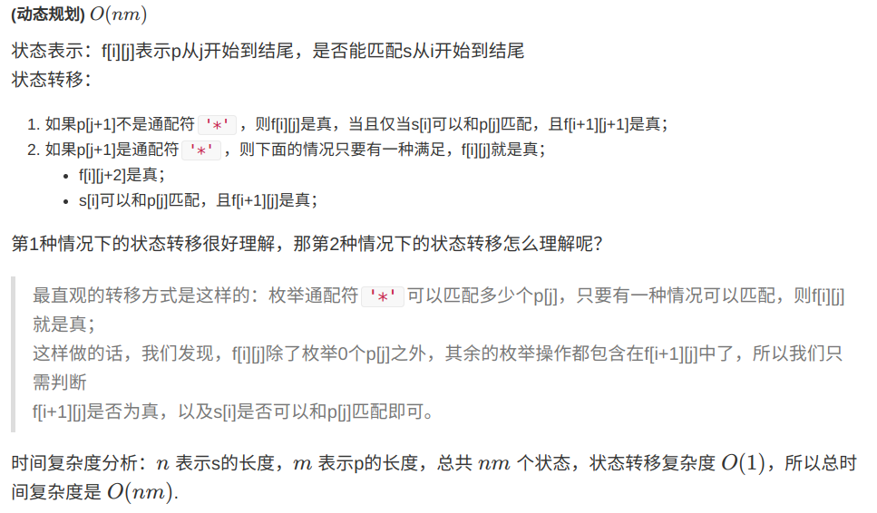

### [10\. 正则表达式匹配](https://leetcode-cn.com/problems/regular-expression-matching/)

Difficulty: **给你一个字符串 s 和一个字符规律 p，请你来实现一个支持 '.' 和 '*' 的正则表达式匹配。 '.' 匹配任意单个字符 '*' 匹配零个或多个前面的那一个元素 所谓匹配，是要涵盖 整个 字符串 s的，而不是部分字符串。   示例 1： 输入：s = "aa", p = "a" 输出：false 解释："a" 无法匹配 "aa" 整个字符串。 示例 2: 输入：s = "aa", p = "a*" 输出：true 解释：因为 '*' 代表可以匹配零个或多个前面的那一个元素, 在这里前面的元素就是 'a'。因此，字符串 "aa" 可被视为 'a' 重复了一次。 示例 3： 输入：s = "ab", p = ".*" 输出：true 解释：".*" 表示可匹配零个或多个（'*'）任意字符（'.'）。   提示： 1 <= s.length <= 20 1 <= p.length <= 30 s 只包含从 a-z 的小写字母。 p 只包含从 a-z 的小写字母，以及字符 . 和 *。 保证每次出现字符 * 时，前面都匹配到有效的字符 **


给你一个字符串 `s` 和一个字符规律 `p`，请你来实现一个支持 `'.'` 和 `'*'` 的正则表达式匹配。

*   `'.'` 匹配任意单个字符
*   `'*'` 匹配零个或多个前面的那一个元素

所谓匹配，是要涵盖 **整个 **字符串 `s`的，而不是部分字符串。

**示例 1：**

```
输入：s = "aa", p = "a"
输出：false
解释："a" 无法匹配 "aa" 整个字符串。
```

**示例 2:**

```
输入：s = "aa", p = "a*"
输出：true
解释：因为 '*' 代表可以匹配零个或多个前面的那一个元素, 在这里前面的元素就是 'a'。因此，字符串 "aa" 可被视为 'a' 重复了一次。
```

**示例 3：**

```
输入：s = "ab", p = ".*"
输出：true
解释：".*" 表示可匹配零个或多个（'*'）任意字符（'.'）。
```

**提示：**

*   `1 <= s.length <= 20`
*   `1 <= p.length <= 30`
*   `s` 只包含从 `a-z` 的小写字母。
*   `p` 只包含从 `a-z` 的小写字母，以及字符 `.` 和 `*`。
*   保证每次出现字符 `*` 时，前面都匹配到有效的字符


#### Solution

想象一下，暴力的话，字符p是需要疯狂枚举的，那么就是指数级别的，所以是非常不可取的

然后类似这种匹配问题会有非常多的子问题产生，那么dp能有效解决这类重复子问题



Language: **c++**

```c++
class Solution
{
public:
    bool isMatch(string s, string p) 
    {
        int n = s.size(), m = p.size();
        s = ' ' + s, p = ' ' + p;
        vector<vector<bool>> f(n + 1, vector<bool>(m + 1));
        f[0][0] = true;
        for (int i = 0; i <= n ; i ++)
            for (int j = 1; j <= m; j ++)
            {
                if (j + 1 <= m && p[j + 1] == '*') continue; // If followed by * then the state is not calculated
                if (p[j] != '*' && i)
                {
                    f[i][j] = f[i - 1][j - 1] && (s[i] == p[j] || p[j] == '.');
                }
                else if (p[j] == '*')
                {
                    f[i][j] = f[i][j - 2] || i && f[i - 1][j] && (s[i] == p[j - 1] || p[j - 1] == '.');
                }
            }

        return f[n][m];
    }
};
```
